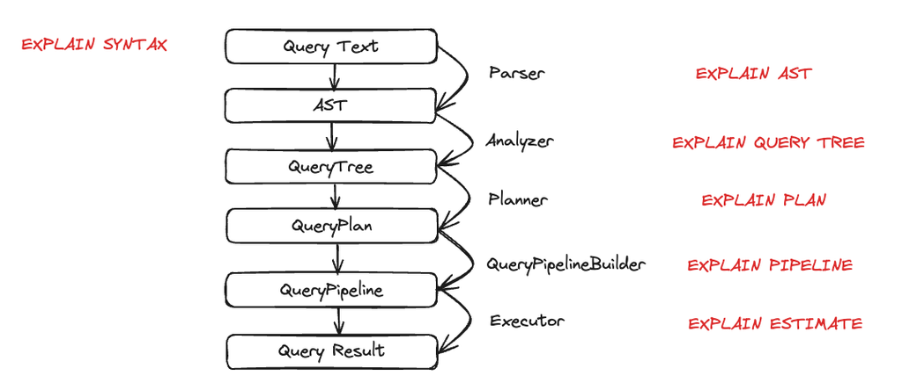

# Clickhouse

## Overview

Clickhouse is a column-oriented online analytical processing (OLAP) database
optimized for real-time analytics.

Clickhouse was launched in 2012 and open-sourced in 2016, and is built with
C++.

## Concepts

https://clickhouse.com/docs/managing-data/core-concepts

### Parts

When data is loaded into Clickhouse, records are grouped into **parts**. These
parts are analogous to segments in other databases such as Pinot or Druid, and
are immutable collections of sorted rows.

Physically, a part is a directory containing files storing column data, on
disk.

Ingested records that make up a part go through the following steps:
1. Sorting according to the table sort key (`ORDER BY` clause in the
    `CREATE TABLE` statement) and a sparse primary index is created based on
    the sort key.
2. Columns are split then compressed.
3. Part data is stored on disk.

A background job periodically merges parts into larger parts (up to a maximum
part size, 150 GB by default). After some time, old inactive parts that were
merged together are deleted. This hierarchical structure of merge parts gives
the name to the storage engine: MergeTree.

Parts can be queried:
```
SELECT _part FROM <table>
```

Conversely:
```
SELECT
    name
    , level
    , row
FROM system.parts
WHERE database = '<database>' AND table = '<table>' AND active
```

Parts follow the naming convention
`partition_min-block-number_max-block-number_level` where the partition is
defined by the table sorting key, and blocks are part subdivisions.

### Partitions

Partitions are defined by the `PARTITION BY` clause of a `CREATE TABLE`
statement, and help manage data.

When a table is partitioned, instead of creating a single part for a group of
rows, Clickhouse creates a part for each partition present in the rows. Also, a
min-max index is added for every part, containing the minimum and maximum value
of the partition columns for as specific part.

Care should be taken when selecting a partition key, because this could lead to
the creation of lots of partitions, which can result in a 'Too many parts'
error when inserting records. A partition key should have a cardinality between
1,000 and 10,000.

Parts are merged withing partitions, not across partitions.

Partitions are useful for:
* Data management: setting a `TTL` on a table allows to delete whole partitions
    to be deleted without rewriting parts.
* Query optimization: partition pruning and granule pruning allow to reduce the
    amount of scanned data. This is only useful if queries filter by the
    partition key. Queries not using the partition key can be slower due to
    the scanning of a larger number of parts.

### Part merges

Parts are hierarchically merged into larger parts. After each merge, a part
`level` is increased by 1 (starting at level 0 for unmerged parts)

Merging is a multi-threaded background process working in a loop:
1. Decide which parts to merge and load them into memory
2. Merge parts in memory into larger part
3. Write resulting part to dis'

Defering merges to an asynchronous background process makes inserts faster.

Not all parts to be merged are necessarily loaded into memory at once, the
merging process works on chunks of parts.

Merging steps:
1. Decompress and load column files into memory
2. Merging per se (preserving sorting order)
3. Generate a new primary index
4. Compress and save column files to disk

Replacing merges operate on a `ReplacingMergeTree` engine table, and keep the
most recent version of each row uniquely defined by the sorting key and the
creation timestamp of the part that contains the row.

In a `SummingMergeTree`, merges replace rows identified by the same sorting key
by a row with the same sorting key and a value equal to the sum of the old
rows. An `AggregatingMergeTree` can also be defined, with a column that has
`AggregateFunction` as type, leading to this specific function being applied
during merges to calculate the value of the new row.

Merges can be monitored using the `/merges` API endpoint.

### Table shards and replicas

This section does not apply to Clickhouse Cloud.

Data can be split across several servers in the form of table shards that make
up a distributed table.

A distributed table is creating by specifying the `Distributed` engine:
```
CREATE TABLE ...
ENGINE = Distributed('<cluster-name>', '<database>', '<table>', <sharding-key>)
```

Shards are replicated across servers for fault-tolerance and query performance
(different queries can run on different replicas in parallel).

### Primary indexes

The sparse primary index helps improve query performance by identifying
granules (logical blocks of 8,192 rows) that match query filters using sorting
key columns. Granules are the smallest unit of data that Clickhouse works with.

The sparse index contains one sorting key value per granule (the first row).
Since the index is small, it fits in memory and allows fast data filtering.

Primary indexes can be queried using the `mergeTreeIndex` table function.

The `EXPLAIN` query shows how the primary index is used (if it is).

### Architecture overview

Components:
* Query processing layer
* Storage layer
* Integration layer
* Access layer (manages user sessions)

Single C++ binary, statically-linked without dependencies.

Vectorized execution model and opportunistic query compilation.

Storage layer has several table engines categories:
1. `MergeTree` family, based on LSM trees. Each engine differs in the way the
   merge works.
2. Special-purpose table engines: in-memory key-value, in-memory temporary
   tables, `Distributed` table engine, etc.
3. Virtual engines for data exchange with external systems (relational
   databases, pub/sub systems, data lakes, object storage, etc.

Operation modes:
* on-premise
* cloud
* standalone (single server, kind of command line utility to transform files)
* in-process mode called chDB, has a Python API, kind of like DuckDB

## Updating data

Clickhouse is not optimized for row updates, and these operations need to be
designed carefully to avoid potential high I/O.

https://clickhouse.com/docs/updating-data

### Update mutation

```
ALTER TABLE <table-name> UPDATE ... WHERE ...
```

This is a heavy I/O operation that rewrites all parts that match the `WHERE`
clause, negatively affecting `SELECT` queries performance. Also, the update is
not atomic and queries can see data as is it being mutated, potentially leading
to inconsistent results.

The table `systems.mutations` shows update progress.

This is an operation that is useful when data should be updated immediately,
e.g. for compliance reasons.

The lack of atomicity of mutations can be addressed by setting the parameter
`apply_mutations_on_fly = 1`. The same high I/O concerns apply.

### Lightweight updates

```
UPDATE <table> SET .. WHERE ...
```

This create 'patch' parts containing only updated rows and columns, instead of
rewriting full parts. Patch parts are immediately visible to `SELECT` queries
and are stitched together with normal parts. This adds overhead to `SELECT`
queries, but avoid high I/O because parts are updated during the merge process.

### ReplacingMergeTree

This is the favorite way to update data. During parts merges, rows that have
the same sorting key are deduplicated and the most recent one is retained.
Merges happen at unknown times in the background, so data may remain duplicated
for some time. This is useful to save space, but does not guarantee the absence
of duplicates.

A cap on the de-duplication interval can be set with the parameter
`min_age_to_force_merge_seconds`, which forces merging of parts older than this
value.

`SELECT` queries can use the clause `FINAL` to force de-duplication at query
time.

There is also a `CollapsingMergeTree` engine but full rows need to be inserted
to perform an update. It's unclear which use cases this serves.

## Delete data

https://clickhouse.com/docs/managing-data/deleting-data/overview

Deleting data follows similar tradeoffs between consistency and performance
compared to updates.

Delete mutations are issued with `ALTER TABLE <table-name> DELETE ...`, and are
applied immediately but not atomically and negatively affect `SELECT` queries.

Lightweight deletions `DELETE FROM ...` are immediately visible but do not
modify physical data until the next merge. This works by adding a `_row_exists`
column to rows, which is used to filter deleted rows.

Truncating a table is performed with a `TRUNCATE TABLE` query, and is a
lightweight operation.

Partitions can be deleted with `ALTER TABLE DROP PARTITION ...` queries.

## Data modeling

https://clickhouse.com/docs/data-modeling/overview

### Schema design

Clickhouse is optimized for reading Parquet files and can read tens of millions
of records per second from Parquet files stored in S3.

#### Optimizing data types

Choosing the right data types allow Clickhouse to compress columns better,
leading to faster queries.

Avoid nullable columns because they create an additional column. E.g. for
numerical values use 0, for string an empty string, etc.

Use the smallest possible size for numeric types, as well as temporal types.

Use LowCardinality and FixedString types if possible.

Enums allow data validation at insert time, and allow to exploit natural
ordering of non-numeric values.

#### Ordering key

The ordering key is specified by the `ORDER BY` clause when creating a table,
and can be composed of several columns.

The ordering key is the primary key of the sparse index associated with a part,
and determine how rows are sorted within a part. This affects column
compression and therefore query speed (more compression = faster queries).

Guidelines to select ordering keys:
* 5 keys maximum is sufficient* 5 keys maximum is sufficient* 5 keys maximum is
    sufficient* 5 keys maximum is sufficient* 5 keys maximum is sufficient* 5
    keys maximum is sufficient* 5 keys maximum is sufficient* 5 keys maximum is
    sufficient* 5 keys maximum is sufficient
* should align with common query filters, so that more rows can be skipped
    during queries using these filters
* prefer columns that are correlated with other columns, in order to maximize
    compression of all columns
* organize key columns by order of increasing cardinality

### Dictionaries

Dictionaries are in-memory key-value representations of data optimized for low
query latency. They are useful for:
* remove the need for joins
* enrich data during ingestion (no need to do it at query time anymore)

A dictionary is created with the `CREATE DICTIONARY` query.

The `dictGet('<dict-name>', '<key-name>', <query-value>)` is used to query a
dictionary.

### Materialized views

Shift some cost of computation from query time to insert time. Can be
'incremental' or 'refreshable' (need to be periodically executed).

Incremental materialized views are not like in relational databases, they are
triggers that query data as it is inserted in a source table, then transform it
(or aggregate, filter, etc.) and insert it in a target table. This saves time
during queries, but increases ingestion latency. The target table is updated
in real time, without a need for periodic execution. 

Incremental materialized views are created with:
```
CREATE MATERIALIZED VIEW <view-name> TO <target-table> AS
<query-from-source-table>
```

The materialized view generally takes advantage of a particular table engine to
aggregate rows during asynchronous merges. Therefore recently inserted rows may
not be aggregated yet, an issue that can be solved using the `FINAL` clause in
the `SELECT` query, or by performing the usual aggregation in the `SELECT`
query.

Tip: for maximum performance, the `GROUP BY` clause should use keys from the
`ORDER BY` clause of the `CREATE TABLE` statement.

To avoid storing raw data, the table where rows are inserted can use the `Null`
engine. Inserted data will only populate the target table of the materialized
view.

Materialized views can use `JOIN`s, but the view will only be triggered when
the left-most table of the join is updated. Dictionaries may be preferrable to
joins for better performance.

Refreshable materialized views are another type of views that differs from
incremental materialized view on two aspects:
* they completely replace the target table with query results (unless `APPEND`
    is added to the view definition, in which case rows are appended to the
    table)
* they run on schedule (and can also be triggered manually)

The statement to create a refreshable materialized view is:
```
CREATE MATERIALIZED VIEW <view-name> REFRESH EVERY <time-value> <time-unit>
[APPEND] TO <target-table> AS
```

### Projections

Projections are a reordering of table rows, and therefore have a different
primary index. This helps speed up some queries that take advantage of this
new data ordering. Projections are automatically kept in sync with the original
table.

Compared to the original table, projections can have:
* a different primary index
* pre-computed aggregates

When a query is run, Clickhouse automatically selects the projection that will
read the least amount of data, and therefore yield the fastest query.

There is two ways to define a projection:
* store full columns (lots of additional storage but the fastest)
* store only a primary index with parts offsets, which is basically an index
    (least amount of data stored, but more I/O and slower queries)

Limitations:
* does not allow a different TTL than the original table
* lightweight updates and deletes are not supported
* projections cannot be chained like materialized views
* projections cannot be joined
* projections do not support `WHERE` clauses

Statement to create a projection:
```
ALTER TABLE <table-name>
ADD PROJECTION <projection-name>
(
    SELECT *
    ORDER BY <sorting-key-columns>
    [GROUP BY ...]
)
```

If there is an aggregation in the projection, then the projection table storage
uses the `AggregatingMergeTree` engine.

Then one must materialize the projection:
```
ALTER TABLE <table-name> MATERIALIZE PROJECTION <projection-name>
```

A projection based on part offsets is created like this:
```
CREATE TABLE <table-name> (
    PROJECTION <projection-name>
        (
            SELECT _part_offset ORDER BY <sorting-key-columns>
        ),
        ...
)
ENGINE = ...
```

Projections VS materialized views:
* projections update asynchronously, (incremental) materialized views update
    synchronously
* projections are queried transparently when a user queries the source table,
    materialized views are explicitly queried
* projections are not compatible with deletes (unless the parameter
    `lightweight_mutation_projection_mode` is used), and materialized views do
    not react to deletes or updates (only to inserts)
* projections cannot be defined using joins, while materialized views can (only
    the leftmost part of the join triggers a materialization)
* projections cannot be defined with `WHERE` clauses, materialized views can
* projections cannot be chained, while materialized views can
* projections are only available for merge tree engines, while materialized
    views are compatible with a broad list of table engines
* for projections insert failures do not lead to data loss, while a
    materialized view insert failure leads to target table data loss
* projections have lower operational burden
* projections do not work with `FINAL` queries, while materialized views do

### Compression

Algorithms used for column compression can be controlled when a table is
created:
```
CREATE TABLE <table-name> (
    <column-name> CODEC(<algo-1>, ...)
    ...
)
...
```

E.g. `ZSTD` works well in most cases, `Delta` works well for monotonically
increasing values. These can be combined, and `ZSTD` compresses well data
already compressed with `Delta`.

## Advanced features

https://clickhouse.com/docs/guides/developer/overview

### Dynamic column selection

Can select columns based on regular expression, and exclude some of them:
```
FROM <table>
SELECT COLUMNS('<regex-1>') [COLUMNS('<regex-2>'), ...] EXCEPT(<col-1)
```


Can apply functions on all columns, e.g. `max`, `avg`, etc. and functions can
be chained:
```
FROM <table>
SELECT COLUMNS('<regex>') APPLY(<func-1>) [APPLY(<func-2>), ...]
```

Can adjust some columns and leave the other untouched:
```
FROM <table>
SELECT
    COLUMNS('<regex>')
    REPLACE(
        <col-1> * 2 AS <col-1>
        , <col-2> / 1.5 AS <col-2>
    )
APPLY(<func-1>)
```

### Merge tables

A merge table does not store data but allows to query from multiple tables
simultaneously by taking a union of table columns and deriving common types
(for columns that have different types).

```
SELECT <cols>
FROM merge(['db_name',] 'tables_regexp')
```

### Query dialects

`clickhouse` is the default query dialect, but we can also use Pipeline
Relational Query Language ([PRQL](https://prql-lang.org/)) or
[Kusto](https://learn.microsoft.com/en-us/kusto/query/?view=azure-data-explorer&preserve-view=true).

```
SET prql
SET kusto
```

### Cascading materialized views

A cascading materialized view uses another materialized view as the source.

This can be useful when hierarchical transformations need to be done and we
want to perform them at data insertion time to make `SELECT` queries faster.
E.g. one materialized view aggregates data per month from raw data, and a
cascading materialized view aggregates the first materialized view output per
year.

Also, multiple materialized views can have the same target table (similar to a
`UNION ALL` logic).

### Debugging memory issues

Query the table `system.processes` and columns `peak_memory_usage`,
`memory_usage`.

List metrics for memory usage in table `system.asynchronous_metrics`, columns
like `%Cach%`, `%Mem%`.

Column `memory_usage` from table `system.merges`.

Columns `data_uncompressed_bytes` (if `part_type` = `InMemory`),
`primary_key_bytes_in_memory`, `primary_key_bytes_in_memory_allocated`,
`index_granularity_bytes_in_memory`,
`index_granularity_bytes_in_memory_allocated` from table `system.parts`.

### Deduplicating inserts on retries

An insert can be successful on the server side but the client did not receive
confirmation, so a retry may lead to duplicate inserts.

When inserting data into `*MergeTree` tables, each block is assigned a
`block_id` which is a hash of data in the block, and used as a unique key for
the insert operation. When the same `block_id` is found in the deduplication
log, it is considered a duplicate and not inserted into the table.

The parameter `non_replicated_deduplication_window` (default is 0) determines
how many of the most recent blocks are examined to deduplicate blocks on
insert.

### Deduplication strategies

Unlinke an OLTP database, Clickhouse inserts data in immutable blocks and does
not check existing rows for incoming row sorting keys when inserting data. Data
with the same sorting key is **eventually** deduplicated at merge time,
therefore a table can have duplicates and `SELECT` queries need to take this
into account.

Deduplication can be implemented using two strategies:
* use `ReplacingMergeTree` to perform upserts at merge time
* use `CollapsingMergeTree` to have simpler queries at the cost of more complex
    implementation

#### Using `ReplacingMergeTree`

`SELECT` queries can use `FINAL` to remove duplicates, but query performance
can suffer for large tables. Sometimes an aggregate function with a `GROUP BY`
query can have better performance e.g. if we know the updated value is always
increasing (count of web page views), we can use `max`.

#### Using `CollapsingMergeTree`

Say we want to count view on Hacker News articles, we have the following table:
```
CREATE TABLE hackernews_views (
    id UInt32,
    author String,
    views UInt64,
    sign Int8
)
ENGINE = CollapsingMergeTree(sign)
PRIMARY KEY (id, author)
```

The `sign` column (name is arbitrary) is either `-1` or `+1`. `-1` indicates
that the previous row should be cancelled. The last row with `+1` is included
in query results.

###  Filling gaps in time-series data

When aggregating time-series data by time, if time intervals have no data they
do not generate records. The `WITH FILL` clause generates a record for such
empty intervals:
```
SELECT
    toStartOfInterval(timestamp, toIntervalMillisecond(100)) AS bucket,
    count() AS count
FROM <time-series-table>
WHERE (timestamp >= xxx AND (timestamp <= yyy)
GROUP BY ALL
ORDER BY bucket ASC
WITH FILL
STEP toIntervalMillisecond(100);
```

There may be missing records at the beginning and end of the aggregated
intervals, which can be solved with `WITH FILL FROM <timestamp>` (inclusive)
and `WITH FILL TO <timestamp>` (exclusive). Both `FROM` and `TO` are optional.

When we make a cumulative sum, we need to use `INTERPOLATE` to ensure there are
values for time buckets where there are no records (the `bar(column, min, max,
width)` function is just a bonus):
```
SELECT
    toStartOfInterval(timestamp, toIntervalMillisecond(100)) AS bucket,
    count() AS count,
    sum(count) OVER (ORDER BY bucket) AS cumulative,
    bar(cumulative, 0, 10, 10) AS barChart
FROM MidJourney.images
WHERE (timestamp >= {start:String}) AND (timestamp <= {end:String})
GROUP BY ALL
ORDER BY bucket ASC
WITH FILL
FROM toDateTime64({start:String}, 3)
TO toDateTime64({end:String}, 3) + INTERVAL 100 millisecond
STEP toIntervalMillisecond(100)
INTERPOLATE (cumulative, barChart);
```

## Transactional support

Inserts into a single partition and table using the `*MergeTree` engine are
kinda ACID:
* atomic (a full block is created with inserted rows or not created if there is
    an error)
* consistent: table constraints are respected
* isolated: concurrent clients do not see partial blocks, clients inside of
    another transaction have snapshot isolation consistency, while client
    outside of it have read uncommitted consistency
* durable: a replica (or more, as defined by `insert_quorum`, default 0) writes
    data to the filesystem before answering to the client, but does not flush
    to disk (controlled by `fsync_after_insert`, default false)

An insert into a `Distributed` table is not transactional as a whole, but
inserts into each shard is transactional.

## Time to live (TTL)

Use cases:
* removing old rows or columns
* move data between storage tiers (not applicable for cloud)
* data rollup (aggregations)

TTL can be defined on columns or tables (this deletes column data based on the
value or the `timestamp` column):
```
CREATE TABLE example1 (
   timestamp DateTime,
   x UInt32 TTL timestamp + INTERVAL 1 MONTH,
   y String TTL timestamp + INTERVAL 1 DAY,
   z String
)
ENGINE = MergeTree
ORDER BY tuple()
```

TTL is applied during merges, which happen at unscheduled times. Merges can be
forced after a timeout with the parameter `merge_with_ttl_timeout` (default 4
hours).

The TTL clause can rollup rows when deleting them (basically a kind of data
compaction) by adding a `GROUP BY` clause in the TTL:
```
CREATE TABLE (
    <col-name-1> ... DEFAULT ...
)
...
PRIMATY KEY <pk>
TTL timestamp + INTERVAL 1 DAY
    GROUP BY <pk>, toStartOfDay(timestamp)
    SET
        <col-name-1> = max(<col-name-2>)
```

The `GROUP BY` must be a prefix of the primary key, and columns set by the TTL
must have a default value.

## Query analyzer



## Joins

Tips for performance:
* Use denormalization, dictionaries, and materialized views to avoid performing
    joins.
* Aim at a maximum of 4 joins in a query.
* Joins are not reordered, so ensure that the smallest table is on the right
    side of the join to ensure the lowest memory overhead.
* Try using `WHERE ... IN ...` instead of joins when possible.
* Apply filters to sub-clauses to minimize the size of joined data.

There are many join algorithms that can be used, depending on whether
performance or memory usage should be optimized.

## Gotchas

When using an aggregating engine (e.g. `AggregatingMergeTree`), special
aggregation query functions  must be used, e.g. `sumMerge`, `avgMerge`, etc.


