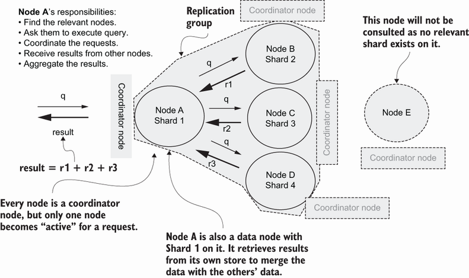

# Elasticsearch

Check
[notebooks](https://github.com/elastic/elasticsearch-labs/tree/main/notebooks).

## Architecture

### Nodes

Node types:
* master
* data
* coordinator (all)
* machine learning
* ingest

### Indexing

Words stored in inverted indexes that map word to documents that contain them.

Relevancy algorithm is Best Match 25 (BM25) by default:
* term frequency / inverse document frequency
* document is more relevant if it has more occurrence of a word
* term more relevant if fewer documents contain it
* non-linear function for term frequency to normalize repetitive terms
* normalization for document length (could have higher term frequency)

Stop words (a, if, but, and, etc.) are not filtered by default during indexing.

We can choose the similarity algorithm for each document fields. When creating
the index, specify `mappings`:
```
{
    "mappings": {
        "properties": {
            "<field-1-name>": {
                "type": "text",
                "similarity": "BM25"
            },
            "<field-name-2>: {
                "type: "text",
                "similarity": "boolean"
            }
        }
    }
}
```

BM25 parameters:
* `k1`: non-linear term frequency saturation variable
* `b`: term frequency normalization factor based on document length

These parameters can be changed by passing them to settings when creating the
index:
```
{
    "settings": {
        "index": {
            "similarity": {
                "custom_bm25": {
                    "type": "BM25",
                    "k1": 1.1,
                    "b": 0.85
                }
            }
        }
    }
}

```

## Lucene query syntax

Query specific fields:
```
title:data
```

Query exact sentence (double quotes):
```
"hello, world"
```

Fuzziness (number of characters that can change, with Levenshtein distance):
```
cat~1
```

Slop (number of word permutations, absence/presence, etc.):
```
"great influence"~2
```

## Query DSL

Match field:
```
{
  "query": {
    "match": {
      "title": "data"
    }
  }
}
```

Match prefix:
```
{
  "query": {
    "prefix": {
      "author": "josh"
    }
  }
}
```

Match with operator:
```
{
  "query": {
    "match": {
      "title": {
        "query": "data engineering",
        "operator": "AND"
      }
    }
  }
}
```

Match multiple fields:
```
{
  "query": {
    "multi_match": {
        "query": "data engineering",
        "fields": ["title^3", "body"]
    }
  }
}
```

Match phrase:
```
{
  "query": {
    "match_phrase": {
      "body": "when you manage people"
    }
  }
}
```

Highlight fields that match in results:
```
{
  "highlight": {
    "fields": {
      "title": {},
      "body": {},
    }
  }
}
```

Boolean query (each of `must`, `must_not`, etc. has a list of queries such as
`match`, `match_phrase`, etc.):
```
{
  "query": {
    "bool": {
      "must": [{ }],
      "must_not": [{ }],
      "should": [{ }],
      "filter": [{ }]
    }
  }
}
```

## Working with documents

### Indexing documents

Various API endpoints exist:
* `PUT <index>/_doc/<id>`: Index a document with an identifier. If the document
    already exists, it is updated and the `_version` attribute is incremented.
    Corresponds to the
    [index()](https://elasticsearch-py.readthedocs.io/en/v9.0.3/api/elasticsearch.html#elasticsearch.Elasticsearch.index)
    method of the Python client.
* `POST <index>/_doc/[<id>]`: Index a document with or without an identifier.
    If the identifier is not provided, it is automatically assigned. If the
    document already exists, it is updated. Corresponds to the
    [index()](https://elasticsearch-py.readthedocs.io/en/v9.0.3/api/elasticsearch.html#elasticsearch.Elasticsearch.index)
    method of the Python client.
* `PUT <index>/_create/<id>`. Index a document with an identifier. If the
    document already exists, the operation fails and a 409 (conflict) error is
    returned. Corresponds to the
    [create()](https://elasticsearch-py.readthedocs.io/en/v9.0.3/api/elasticsearch.html#elasticsearch.Elasticsearch.create)
    method of the Python client.

If the target index does not exist, it is created unless the cluster settings
attribute `action.auto_create_index` is `false`.

A document is not searchable before a refresh has occured and the document is
included in data segments. A refresh occurs
every second by default but can be controlled:
* On the server side with the cluster settings attribute
    `index.refresh_interval`.
* On the client side, the request parameter `refresh` (boolean or `wait_for`)
    controls if indexing should be immediately followed by a refresh, or if the
    request should return a response once an automatic refresh has occured.

### Retrieving documents

`GET <index>/_doc/<id>` retrieves the document with the requested identifier.
The boolean response field `found` indicates if the document was found or not.
The response field `_source` contains the document. Corresponds to the
[get()](https://elasticsearch-py.readthedocs.io/en/v9.0.3/api/elasticsearch.html#elasticsearch.Elasticsearch.get)
method of the Python client.

`HEAD <index>/_doc/<id>` determines if the document exists in the index or not.
Corresponds to the
[exists()](https://elasticsearch-py.readthedocs.io/en/v9.0.3/api/elasticsearch.html#elasticsearch.Elasticsearch.exists)
of the Python client (returns 200 if found, else 404).

`GET [<index>/]_mget` retrieves multiple documents with a list of identifiers or
documents. If documents are in the same index, provide the index a the list of
identifiers in the request body. If documents are in different indexes, omit
the index name and provide a list of documents in the request body:
`[{"_index": "zorglub", "_id": 1}, ...]`. Corresponds to the
[mget()](https://elasticsearch-py.readthedocs.io/en/v9.0.3/api/elasticsearch.html#elasticsearch.Elasticsearch.mget)
method of the Python client.

Documents can also be retrieved by identifier with a `GET <index>/_search`
request, if the request body is structured as `{"query": {"ids": {"values": [...]}}}`.

The request parameters `_source` (boolean), `_source_includes` and
`_source_excludes` (both comma-separated value strings) control if and what
document data is retrieved. Field prefixes can be specified with an asterisk,
e.g. `_source_includes=prefix*`.

### Updating documents

Segments are immutable, so Elasticsearch performs updates by reading the
document, modifying it, then storing the modified document. The API endpoint to
perform udpates is `POST <index>/_update/<id>`, corresponds to the
[update()](https://elasticsearch-py.readthedocs.io/en/v9.0.3/api/elasticsearch.html#elasticsearch.Elasticsearch.update)
method of the Python client.

The endpoints used for document indexing can also update a document, but do not
work with partial documents, the full document needs to be provided.

To add fields, pass a partial document with new fields in the request body. To
update an existing field, pass the new field value in the request body. To
update arrays, the full array with existing and new elements must be provided.

Scripts can be used to update documents, e.g.:
```
POST test/_update/1
{
  "script" : {
    "source": "ctx._source.counter += params.count",
    "lang": "painless",
    "params" : {
      "count" : 4
    }
  }
}
```

The request `POST <index>/_update_by_query` allows to provide both a query and
a script to perform updates. If not query is provided, all documents are
updated. If a document changed between the time Elasticsearch received the
request and it performs the update, the update for this document fails.

### Deleting documents

By identifier: `DELETE <index>/_doc/<id>`. The response includes
`"result": "deleted"` and `_version` is incremented if the operation is
successful.

By script with a query following the same syntax as search queries: `POST <index>/_delete_by_query`.

### Bulk operations

The body of the request has two lines per document, the first line indicates
the operation and the second line the document contents, following [new
line-delimited JSON](https://ndjson.org) syntax.
```
POST _bulk
{ "index" : { "_index" : "test", "_id" : "1" } }
{ "field1" : "value1" }
...
```

With the Python client:
```python
resp = client.bulk(
    operations=[
        {
            "index": {
                "_index": "test",
                "_id": "1"
            }
        },
        {
            "field1": "value1"
        },
        {
            "delete": {
                "_index": "test",
                "_id": "2"
            }
        },
        {
            "create": {
                "_index": "test",
                "_id": "3"
            }
        },
        {
            "field1": "value3"
        },
        ...
    ]
)
```

### Reindexing

Reindexing copies documents from a source index to a target index (e.g. with a
different schema).

```
POST _reindex
{
  "source": {
    "index": ["my-index-000001", "my-index-000002"]
  },
  "dest": {
    "index": "my-new-index-000002"
  }
}
```

Reindexing should be performed on a green cluster to avoid potential failures.

## Index operations

### Creating indexes

Indexes are created automatically if the cluster setting
`action.auto_create_index` is `true` (default) and a document is created on a
non-existent index. Default index settings and mappings are used. Disabling
automatic index creation can affect tools like Kibana, which create
house-keeping indexes. Automatic index creation can be enabled for some index
prefixes, e.g. `action.auto_create_index: [".*"]` allows indexes prefixed with
a dot.

When creating indexes, the following configuration can be specified:
* Mappings: document field names and types.
* Settings: number of shards, replicas, compression, etc. Static settings can
    only be specified during creation (e.g. number of shards), while dynamic
    settings can be changed on live indexes (e.g. number of replicas, refresh
    interval, etc.).
* Aliases: alternative names that can be used to refer to the index.

Indexes are created explicitly using the [PUT
<index>](https://www.elastic.co/docs/api/doc/elasticsearch/operation/operation-indices-create)
API endpoint. Corresponds to the
[indices.create()](https://elasticsearch-py.readthedocs.io/en/latest/api/indices.html#elasticsearch.client.IndicesClient.create)
Python client method.

Dynamic settings can be updated using the `PUT <index>/_settings` endpoint.
Corresponds to the
[indices.put_settings()](https://elasticsearch-py.readthedocs.io/en/latest/api/indices.html#elasticsearch.client.IndicesClient.put_settings)
method on the Python client.

The number of shards is a static setting because this affect document routing.
Changing the number of shards can be achieved via reindexing to a destination
index with the desired number of shards.

Retrieve settings with the `GET <index>/_settings` endpoint.

Mappings can be specified using the following syntax:
```
{
    "mappings": {
        "properties": {
            "<field-name-1": {
                "type": "field-name-1-type",
            },
            "<field-name-2": {
                "properties": {
                    ...
                }
            }
        }
    }
}
```

Fields with properties implictly specific an `object` type.

Aliases allow zero-downtime reindexing, as the alias can point to the new index
when it is ready. Aliases can be specified during index creation as:
```
{
    "aliases": {
        "<index-alias>: {}
    }
}
```

The API endpoint `PUT|POST <index>/_alias/<name>` can also be used to create of
update aliases. The index name can be comma-separate index names, or contain a
wildcard.

If an alias points at several indexes, one must be flagged as the write index
using the `"is_write_index": true` option.

Steps for zero-downtime reindexing:
1. Create alias for existing index.
2. Create new index with desired configuration.
3. Reindex documents from existing to new index.
4. Update alias to point to new index.
5. Delete old index.

### Reading indexes

Use the following endpoints:
* `GET <index>`
* `GET <index>/_settings`
* `GET <index>/_mappings`
* `GET <index>/_aliase`
* `HEAD <index>` to determine if it exists

Hidden indexes are prefixed with a dot, e.g. `.admin`. A query to `GET _all`
will return them.

### Deleting indexes

Endpoint `DELETE <index>`.

### Opening and closing indexes

A closed index does not allow read or write operations. Also, memory allocated
for data structures used for search is reclaimed, resulting in lower cluster
overhead. Close an index with `POST <index>/_close`.

To open an index, query `POST <index>/_open`.

### Index templates

Index templates allow to reuse index configuration.

Two types:
* composable (indexing) templates, made of zero or more components, can exist on their own
* component templates, used to build composable templates

Create indexing templates:
```
PUT _index_template/<name>
{
    "index_patterns": [...],
    "priority": 1,
    "template": {
        "mappings": {},
        "settings": {},
        "aliases": {},
        "lifecycle": {}
    },
    "composed_of": [...]
}
```

Priority defines which template should be used when several match. Highest
priority wins.

Create component templates:
```
PUT _component_template/<name>
{
    "template": {
        ...
    }
}
```

### Monitoring indexes

Index statistics `GET <index>/_stats`. Response `_all` block has stats for all
indices.

Segment statistics `GET <index>/_stats/_segments`.

### Advanced operations

#### Splitting an index

Splitting an index increases the number of shards, useful to increase index
parallelism and keep index configuration.

Steps:
1. Make index read-only by applying setting `index.blocks.write: true`
2. Make split request:
    ```
    POST <source-index>/_split/<target-index>
    {
        "settings": {
            "index.number_of_shards": <n>
        }
    }
    ```

Target index must not exist. New number of shards must be multiple of old
number of shards.

#### Shrink index

Pre-requisites:
* Index must be read-only
* A copy of all shards must be on the same node

```
PUT <index>/_settings
{
    "settings": {
        "index.blocks.write": true,
        "index.routing.allocation.require._name": "<node-name>"
    }
}
```

Shrink the index:
```
PUT <source-index>/_shrink/<target-index>
{
    "settings": {
        "index.blocks.write": null,
        "index.routing.allocation.require._name": null,
        "index.number_of_shards": <n>
    }
}
```

The source number of shards must be a multiple of the target.

#### Rollover an index

Rollover creates a new blank index that is used to write new documents.

Steps:
1. Alias is created on old index:
    ```
    POST _aliases
    {
        "actions": [
            {
                "add": {
                    "index": "<old-index-name>",
                    "alias": "<alias-name>",
                    "is_write_index": true
                }
            }
        ]
    }
    ```
2. Issue rollover request: `POST <alias-name>/_rollover/[<target-index>]`.

The rollover operation will automatically create the new index and remap the
alias to point to it.

If the old index name is suffixed with a number and the target index is not
provided in the request, the new index will have an incremented number, with
6 digits and zero-padded.

#### Index lifecycle management

Index lifecycle management (ILM) can automate rollovers, e.g. writing new logs
to a new index for the day.

We can create an ILM policy and attach it to indexes:
1. Define a policy with `PUT _ilm/policy/<policy-name>`.
2. Create an index with a policy:
    ```
    PUT <index-name>
    {
        "settings": {
            "index.lifecycle.name": "<policy-name>"
        }
    }
    ```

Policies are scanned every 10 minutes by default, can be adjusted with cluster
setting `indices.lifecycle.poll_interval`.

## Text analysis

### Analyzer components

Text is analyzed during indexing and searching (when a query is processed).

Analsysis = tokenization + normalization (token processing such as stemming,
synonyms, removal of irrelevant tokens such as stop words).

API endpoint to test text analysis is 
[GET \_analyze](https://www.elastic.co/docs/api/doc/elasticsearch/operation/operation-indices-analyze):
```
GET _analyze
{
    "tokenizer": ...,
    "filter": [...],
    "text": ...
}
```

Analysis steps:
1. Character filtering (0 or more filters, e.g. HTML tag filtering)
2. Tokenization (1 mandatory tokenizer)
3. Token filters (0 or more filters, e.g. stop words)

### Built-in analyzers

Standard analyzer has:
* no character filter
* standard tokenizer (grammar-based tokenization, splits at whitespace and
    removes punctuation)
* lowercase token filter

Enable the english stopwords filter on an index analyzer:
```
PUT _index/<index-name>
{
    "settings": {
        "analysis": {
            "analyzer": {
                "standard_with_english_stopwords": {
                    "type": "standard",
                    "stopwords": "_english_",
                }
            }
        }
    }
}
```

Custom stopwords can be stored in a file (put the file in the `config` folder,
one word per line):
```
"analyzer": {
    "standard_with_english_stopwords": {
        "type": "standard",
        "stopwords_path": "custom_stopwords.txt"
    }
}
```

Keyword analyzer:
* no character or token filters
* no-op tokenizer (text is stored as-is)

Fingerprint analyzer:
* no character filter
* standard tokenizer
* token filters: lowercase, ASCII folding (convert all to ASCII), stopwords,
    fingerprint (remove duplicates and store words in sorted order, as a single
    token)

Pattern analyzer uses pattern tokenizer, which uses a regular expression to
split text into tokens.

Language analyzers can tokenize most common languages.

### Custom analyzers

Specify custom analyzer when creating an index:
```
PUT _index/<index-name>
{
    "settings": {
        "analysis": {
            "analyzer": {
                "my_custom_analyzer": {
                    "type": "custom",
                    "char_filter": ["html_strip"],
                    "tokenizer": "standard",
                    "filter": ["lowercase", "stop"]
                }
            },
            "filter": {
                "stop": {
                  "type": "stop",
                  "stopwords": "_english_"
                }
            }
        }
    },
}
```

### Specifying analyzers

Index-level analyzers, specify in the analysis attribute when creating an index
(what most previous examples showed).

Field-level analyzers: specify analyzer in mappings when creating an index.

Query-level analyzers:
* specify as part of the query
* specify during index creation as part of mappings, as `search_analyzer`

Analyzer precedence (from highest to lowest):
1. Query
2. `search_analyzer` index mappings
3. Index

### Character filters

Used to remove, add, or replace characters in the text.

#### HTML strip

Removes HTML tags.

Can specify tags to keep, by specifying a list of `escaped_tags` in a custom
character filter.

#### Mapping characters

Replace characters by using a key-value definition. Characters not specified in
the mapping definition are left untouched.

Mappings can be specified in a file, provide the path in `mappings_path` and
use the following format: one entry per line, `key=>value`.

#### Pattern-replace

Replace characters based on a regular expression. Specify the fields `pattern`
and `replace` in a custom character filter.

### Tokenizers

Standard tokenizer is grammar-based: split text based on word boundaries and
punctuation.

#### N-gram and edge N-gram

N-grams are sequences of a given size prepared given a word. 2-grams for coffee
are: co, of, ff, fe, ee.

Edge N-grams are anchored at the beginning of a word. For coffee: c, co, cof,
coff, coffe, coffee.

Configuration (not exhaustive) for `ngram` and `edge_ngram` tokenizers:
* `min_char`: minimum number of characters
* `max_char`: maximum number of characters
* `token_chars`: list of character classes (letter, digit, etc.) that should be
    included in a token (default [] to include all)

#### Other tokenizers

Keyword, pattern, path hierarchy, etc.

### Token filters

50 token filters available.

Synonyms, word stems, etc.

## Search



### Search fundamentals

Two ways to query search endpoint:
* URI request: `GET <index>/_search?q=title:godfather`
* domain-specific language (DSL):
  ```
  GET movies/_search
  {
    "query": {
      "match": {
        "title": "godfather"
      }
    }
  }
  ```

Search context:
* Query: Calculates a relevance score, important for results ranking. See DSL
    query above for an example.
* Filter: Does not calculate relevance score, binary filtering of results,
    either a document matches or it does not, faster results when ranking is
    not critical. Filters are cached, leading to more efficient queries.

Example filter context query:
```
GET <index>/_search
{
    "query": {
        "bool": {
            "filter": [
                "match": {
                    "title": "godfather"
                }
            ]
        }
    }
}
```

`bool` query is a compound query with several possible clauses: `must`,
`must_not`, `should`, `filter`.

`aggs` queries perform aggregations, e.g.:
```
GET movies/_search
{
  "size": 0, 
  "aggs": {
    "average_movie_rating": {
      "avg": {
        "field": "rating"
      }
    }
  }
}
```

Set `size` to 0 to avoid returning hits, since we are only interested in the
aggregate value.

### Anatomy of a response

Response attributes:
* `took`: Time in milliseconds for the search to complete (excluding HTTP
    request/response overhead time).
* `hits.hits`: Array of search results.

### Query DSL

Query structure:
```
GET <index>/_search
{
    "query": {
        <query-type>": {
            ...
        }
    }
}
```

### Leaf and compound queries

Leaf queries look for a particular value in a particular field.

Compound queries wrap leaf queries or other compound queries to compbine
several searches in a logical fashion (e.g. `bool` query).

### Search features

### Pagination

Set page size with `size` parameter, and the starting result page with `from`:
```
GET <index>/_search
{
  "size": 20,
  "from": 20,
  "query": {
    ...
  }
}
```

This will fetch result items between 20 and 40 (i.e. the second page of
results).

### Highlight

Highlight the search query:
```
GET movies/_search
{
  "_source": false,
  "query": {
    "term": {
      "title": {
        "value": "godfather"
      }
    }
  },
  "highlight": {
    "fields": {
      "title": {}
    },
    "pre_tags": "{{",
    "post_tags": "}}",
  }
}
```

By default, highlight tags are HTML `<em>` tags. Specify custom tags with
`pre_tags` and `post_tags`.

### Explain

Explain how the relevancy score was calculated:
```
GET <index>/_search
{
  "explain": true,
  "query": {
    ...
  }
}
```

Results are explained in the `_explanation` field.

Or use the `_explain` API:
```
GET <index>/_explain/<doc-id>
{
    "query": {
        ...
    }
}
```

### Sort

By default, results are sorted by descending order of relevance score.

We can sort results using different criteria with the `sort` attribute:
```
GET <index>/_search
{
  "query": {
    ...
  },
  "sort": [
    {
      "<field-name>": {
        "order": "desc"
      }
    }
  ]
}
```

We can sort according to multiple fields by adding fields to the `sort` list,
subsequent fields are used to break ties.

### Manipulating results

Suppress documents and just return metadata (document ID, score, highlights,
etc.):
```
GET <index>/_search
{
    "_source": false,
    "query": {
        ...
    }
}
```

Fetching selected fields (which are returned as an array):
```
GET <index>/_search
{
    "_source": false,
    "query": {...}
    "fields": [<field-name-1, <field-name-2, ...],
}
```

Scripting results (results `fields` attribute will contain the field
`top_rated_movie`):
```
GET <index>/_search
{
  "query": {...},
  "script_fields": {
    "top_rated_movie": {
      "script": {
        "lang": "painless",
        "source": "if (doc['rating'].value > 9.0) 'true'; else 'false'"
      }
    }
  }
}
```

Filter document fields:
```
{
    "query": {...},
    "_source": [...]
    }
```

Or:
```
{
    "query": {...},
    "_source": {
        "includes": [...],
        "excludes": [...]
    }
}
```

Searching across indexes, and boost certain indexes:
```
GET _search
{
    "indices_boost": [
        {<index-1>: <float>},
        {<index-2>: <float>},
        ...
    ],
    "query": {...}
}
```

## Term searches

### Overview of term-level search

Term search is suitable when searching for exact matches, usually structured
fields such as dates, booleans, ranges, keywords, etc.

Matching documents have a relevance score by default, but it does not matter
and we can use constant scoring for efficiency (save computation cost, and
cache query).

Term searches are not analyzed (no tokenization or normalization like
lower-casing), so they produce results only for exact matches, and are
therefore not a great fit for text fields.

Query example, where the `certification` field is of type `keyword`:
```
GET <index>/_search
{
    "query": {
        "term": {
            "certification": "R",
        }
    }
}
```

### `terms` query

Query multiple values with `terms` query (array can contain up to 65,536
elements, can be modified with index setting `max_terms_count`):
```
GET <index>/_search
{
    "query": {
        "terms": {
            "certification": ["R", "PG-13"]
        }
    }
}
```

Term lookup search (get search value from a specific document):
```
GET <index>/_search
{
    "query": {
        "terms": {
            <field-to-search>: {
                {
                    "index": <index-to-get-value-from>,
                    "id": <document-id>,
                    "path": <field-path>
                }
            }
        }
    }
}
```

### `ids` query

Fetch documents with the specified identifiers:
```
GET <index>/_search
{
    "query": {
        "ids": {
            "values": [...]
        }
    }
}
```

Equivalent to:
```
GET <index>/_search
{
    "query": {
        "terms": {
            "_id": [...]
        }
    }
}
```

### `exists` query

Return documents that have a specific field:
```
GET <index>/_search
{
    "query": {
        "exists": {
            "field": <field-name>
        }
    }
}
```

Can also be used as a negative filter (e.g. documents that do not contain a
specific field):
```
GET <index>/_search
{
    "query": {
        "bool": {
            "must_not": [
                {
                    "exists: {
                        "field": <field-name>
                    }
                }
            ]
        }
    }
}
```

### `range` query

Find documents where a specific field is between a lower bound `gte`
(inclusive) and an upper bound `lte` (inclusive):

```
GET <index>/_search
{
  "query": {
    "range": {
      "<field-name>": {
        "gte": 9.0,
        "lte": 9.5
      }
    }
  }
}
```

Exclusive operators `gt` and `lt`.

Can filter numerical fields, dates, etc.

Relative date filtering (date minus 2 days):
```
"range": {
    "release_date": {
        "lte": "22-05-2023||-2d"
    }
}
```

Relative date filtering (for the past year):
```
"range": {
    "release_date": {
        "gte": now-1y"
    }
}
```

### Wildcard queries

Types of wildcards:
* `*`: zero or more characters
* `?`: a single character

```
GET <index>/_search
{
  "query": {
    "wildcard": {
      "<field>": {
        "value": "<prefix>*"
      }
    }
  }
}
```

Wildcard queries are expensive, they put a higher load on nodes than other
types of queries. Range queries are expensive as well. Expensive queries can be
disabled with the cluster setting `search.allow_expensive_queries` set to
`false`.

### Prefix queries

```
GET <index>/_search
{
  "query": {
    "prefix": {
      <field-name>: {
        "value": <prefix>
      }
    }
  }
}
```

Prefix queries are expensive.

Prefix queries can be sped up by flagging fields that will be subject to such
queries in mappings. Elasticsearch will build prefixes when indexing documents.

```
{
  "mappings": {
    "properties": {
      "<field-name>":{
        "type": "text",
        "index_prefixes":{
            "min_chars": 4,
            "max_chars": 10
        }
      }
    }
  }
}
```

`min_chars` is 2 by default and `max_chars` is 5 by default.

### `fuzzy` queries

Deal with spelling mistakes. Fuzziness is defined by Levenshtein distance (aka
edit distance). A fuzziness of 1 will find words that differ by 1 character
from the query value.

```
GET <index>/_search
{
  "query": {
    "fuzzy": {
      "<field-name>": {
        "value": "...",
        "fuzziness": 1
      }
    }
  }
}
```

Fuzziness is applied by default, depending on word length:
* 0 to 2: fuzziness = 0
* 3 to 5:  fuzziness = 1
* greater than 5: fuzziness of 2

## Full-text search

### Overview

Full-text search targets unstructured data, and ranks results based on
relevance scores.

Relevance is measured with:
* Precision: Proportion of relevant documents over documents returned by a
    search (which includes both relevant and irrelevant documents).
* Recall: Proportion of returned relevant documents over all relevant
    documents. 

Precision and recall are inversely correlated, and optimizing for one usually
imparis the other one.

### `match_all` queries

Retrieve all documents from the index. Maximum recall, but low precision
because many results are not relevant. Omitting the request body has the same
effect as specifying `match_all`.

```
GET <index>/_search
{
    "query": {
        "match_all": {}
    }
}
```

All hits have a score of 1.0.

There is also a `match_none` query, which can be used to lock down an index for
maintenance purposes.

### `match` query

```
GET books/_search
{
  "query": {
    "match": {
      "<field-name>": "<search text>"
    }
  }
}
```

`match` queries are analyzed using the same analyzer defined in the index,
unless a specific analyzer is passed as part of the query.

If the search text is made of several words, they are logically `OR`-ed by
default. This can be changed using the `operator` parameter (need to use the
query long format):
```
{
  "query": {
    "match": {
      "title": {
        "query": "Elasticsearch in Action",
        "operator": "AND"
      }
    }
  }
}
```

The minimum number of matching words is specified with `minimum_should_match`:
```
{
  "query": {
    "match": {
      "title": {
        "query": "Elasticsearch in Action",
        "operator": "AND",
        "minimum_should_match": 2
      }
    }
  }
}
```

Fuzziness (character variations) can also be specified:
```
{
  "query": {
    "match": {
      "title": {
        "query": "bat",
        "fuzziness": 1
      }
    }
  }
}
```

### `match_phrase` query

Find documents that exactly match a phrase:
```
{
  "query": {
    "match_phrase": {
      "body": "a book for Python programmers"
    }
  }
}
```

The `slop` parameter allows variations in presence/absence of query words:
```
{
  "query": {
    "match_phrase": {
      "body": {
        "query": "Python programmer",
        "slop": 3
      }
    }
  }
}
```

### `match_phrase_prefix` query

Similar to `match_phrase`, except that the last word of the query is used as a
prefix, e.g. `develop` would match `development`, `developers`, etc.

### `multi_match` query

A query is matched against several document fields. Individual fields can be
boosted using the `<field-name>^<boost>` syntax:
```
{
  "query": {
    "multi_match": {
        "query": "data",
        "fields": ["title^2, "body"]
    }
  }
}
```

By default, the search type is `best_fields`, meaning fields with more search
words occurrences rank higher. This uses a `dis_max` (disjunction max) compound
query under the hood. The previous query is equivalent to:
```
{
  "query": {
    "dis_max": {
      "queries": [
        {"match": {"title": "data"}},
        {"match": {"body": "data"}}]
    }
  }
}
```

The score depends on the field that scores higher, and ties can be broken using
the `tie_breaker` attribute, which is used to weight the score of other fields:
```
{
  "query": {
    "multi_match": {
        "query": "data",
        "fields": ["title, "body"]
        "tie_breaker": 0.5
    }
  }
}
```

### `query_string` queries

Perform a query based on a string with a specific
[syntax](https://www.elastic.co/docs/reference/query-languages/query-dsl/query-dsl-query-string-query#query-string-syntax)
instead of building the query as a JSON object.

For example:
* Search a specific field: `<field-name>:<search-text>`
* Search an exact phrase: `"<search-text>"`
* Fuzziness: `bat~2`
* Slop: `"great expectations"~2`
* Regular expressions: `/joh?n(ath[oa]n)/`
* Ranges: `<date-field>:[2012-01-01 TO 2012-12-31]`

We can specify:
* default field to use for the search (instead of all fields if the query
    string does not specify fields)
* the default logical operator (instead of `OR` if the query does not specify)

```
{
    "query": {
        "query_string": {
            "query": "hello world",
            "default_field": "title",
            "default_operator": "AND"
        }
    }
}
```

The query string syntax is sensitive, and any syntax error will lead to a bad
request (status code 400). In the Python client, catch the `BadRequestError`
exception and get `response["error"]["root_cause"][0]["reason"]` to get the
error message.

The `simple_query_string` query is similar to `query_string` but has a simpler
syntax and does not error when a syntax error is encountered. Instead, it
returns no search results.

## Compound queries

### `bool` queries

Combines boolean clauses, each with a leaf query made of term-level or
full-text queries.

Clauses:
* `must`: an `AND` query.
* `must_not`: a `NOT` query.
* `should`: an `OR` query.
* `filter`: similar to `must` but no score is calculated.

Query structure:
```
GET <index>/_search
{
    "query": {
        "bool": {
            "must": [{}],
            "must_not": [{}],
            "should": [{}],
            "filter": [{}]
        }
    }
}
```

Example `must` clause:
```
{
    "query": {
        "bool": {
            "must": [
                {"match": {{"product": "TV"}}},
                {"range": {"price": {"gte": 700, "lte": 800}}},
                {"term": {"resolution": "4K"}},
                {"terms": {"color": ["silver", "black"]}}
            ]
        }
    }
}
```

`must_not` clauses do not influence hits score, because they are executed in a
filter context.

If `should` queries are used with a `must` query, none of the `should` queries
are mandatory matches to get results, and they serve as score boosters. The
parameter `minimum_should_match` can be set to enforce a specific number of
`should` queries that should match.

Because `filter` queries do not calculate a score, they run faster than their
`must` counterparts. Also, Elasticsearch caches query results, so performance
gets another boost. If `filter` is used with `must` or `should`, a score is
still calculated.

### Named queries

```
{
    "query": {
        "bool": {
            "must": [
                {
                    "match": {
                        "<field>": {
                            "query": "<search-text>",
                            "_name": "<query-name>"
                        }
                    }
                }
            ]
        }
    }
}
```

Each result hit has an attribute `matched_queries` that lists the queries that
this particular hit matched.

### Constant score

All results have the same score, specified in the `boost` parameter. The point
is to boost other queries as part of a compound query. E.g. to boost the score
of a `must` query:

```
{
    "query": {
        "bool": {
            "must": [
                {
                    "match": {"product": "TV"}
                },
                {
                    "constant_score": {
                        "filter": {"term": {"colour": "black"}},
                        "boost": 3.5
                    }
                }
            ]
        }
    }
}
```

### Boosting query

There are two parts:
* Positive part: what we are searching.
* Negative part: reduces the relevance score if it matches.

```
{
  "query": {
    "boosting": {
      "positive": {
        ...
      },
      "negative": {
        ...
      },
      "negative_boost": 0.5
    }
  }
}
```

In the previous query, the score calculated by the positive matches is reduced
by 0.5

Compound queries can make up positive or negative blocks.

### Disjunction max query

The `dis_max` query wraps several queries and expects at least one of them to
match. If more than one query matches, the `dis_max` query returns the
documents with the highest relevance score.

We can also use the score of other queries (that do not have the maximum score)
with a `tie_breaker` parameter (float): the score will be updated by
multiplying the tie breaker to non-maximum scores and adding them to the
core.

### `function_score` query

Generate a custom score based on user-defined requirements.

```
{
    "query": {
        "function_score": {
            "query": {
                "term": {
                    "product.keyword": {
                        "value": "TV",
                    },
                },
            },
            "<score-function>": {},
        },
    }
}
```

Score functions:
* `random_score`: use `seed` and `field` attributes for reproducibility.
* `script_score`: use a script to calculate the score
* `field_value_factor`: use value of fields without script complexity, set the
    attributes `factor` (e.g. 3) and `modifier` (e.g. square).

Score functions can be combined by passing a list of functions in the
`functions` attributes of the query.

## Advanced search

### Geosearch

#### Overview

`bounding_box` query finds documents within a rectangular area.

`geo_distance` query finds documents within a radius from a specific location.

`geo_shape` query finds documents enclosed in a polygon.

Geo-spatial data types:
* `geo_point`: Defined by latitude and longitude. Data format are
    `<lat>, <lon>` or `{"lon": <lon>, "lat": <lat>}` or `[<lon>, <lat>]`, or
    geohash.
* `geo_shape`: Defined using [GeoJSON](http://geojson.org/). Can represent
    point, multiple points, polygon, etc. GeoJSON format is
    `POINT (<lon>, <lat>)` (note longitude precedes latitude).

#### `geo_bounding_box` query

`geo_bounding_box` query (provide location of top-left and bottom right
corners of the box):
```
GET <index>/_search
{
  "query": {
    "geo_bounding_box": {
      "<field-name>": {
        "top_left": [0.2, 52],
        "bottom_right": [0.1, 49]
      }
    }
  }
}
```

Equivalent query in array format (longitude first):
```
{
  "query": {
    "geo_bounding_box": {
      "<field-name>": {
        "top_left": {
          "lat": 52,
          "lon": 0.2
        },
        "bottom_right": {
          "lat": 49,
          "lon": 0.1
        }
      }
    }
  }
}
```

Equivalently in WKT BBOX:
```
"geo_bounding_box": {
    "location": {
        "wkt":"BBOX(0.2, 0.1, 52.00, 49.00)"    ❶
    }
}
```

All document scores are the same (i.e. boolean inside VS outside box).

#### `geo_distance` query

```
GET <index>/_search
{
  "query": {
    "geo_distance": {
      "distance": "175 km",
      "<field-name>": {
        "lat": 50.00,
        "lon": 0.10
      }
    }
  }
}
```

Also accepts distance in miles: `100mi` (with or without space between value
and units).

#### `geo_shape` query

```
GET cafes/_search
{
  "query": {
    "geo_shape": {
      "<field-name>": {
        "shape": {
          "type": "envelope",
          "coordinates": [
            [0.1,55],
            [1,45]
          ]
        },
        "relation": "within"
      }
    }
  }
}
```

Relations:
* `intersects` (default): document may be partially enclosed by shape
* `within`: document must be totally enclosed by shape
* `contains`: documents that contain the shape
* `disjoint`: documents that do not overlap with the shape

#### `shape` query

Query fields with type `shape`:
```
{
  "mappings": {
    "properties": {
      "<field-name>":{
        "type": "shape"
      }
    }
  }
}
```

Search query:
```
GET <index>/_search
{
  "query": {
    "shape": {
      "<field-name>": {
        "shape": {
          "type":"envelope",
          "coordinates":[[10,16],[14,10]]
        }
      }
    }
  }
}
```

### `span` query

Useful to find tokens within a specific distance from each other.

#### `span_first`

`span_first` query (find documents with token in the first nth position of the
document):
```
GET <index>/_search
{
  "query": {
    "span_first": {
      "match": {
        "span_term": {
          "<field-name>": "<term-to-search>"
        }
      },
      "end": 5
    }
  }
}
```

Be careful with term queries (not analyzed) on analyzed fields (such as text),
because they may be normalized (as with the standard analyzer)
and not return results.

#### `span_near`

Find words that are within N words from each other:
```
GET <index>/_search
{
  "query": {
    "span_near": {
      "clauses": [
        {
          "span_term": {
            "<field-name>": "<word-1>"
          }
        },
        {
          "span_term": {
            "<field-name>":  "<word-2>"
          }
        }
      ],
      "slop": <number-of-words-in-between>,
      "in_order": <true|false>
    }
  }
}
```

#### `span_within`

Find a word between two other flanking words.

```
GET <index>/_search
{
  "query": {
    "span_within": {
      "little": {
        "span_term": {
          "<field-name>": "<word-in-between>"
        }
      },
      "big": {
        "span_near": {
          "clauses": [
            {
              "span_term": {
                "<field-name>": "<word-flanking>"
              }
            },
            {
              "span_term": {
                "<field-name>": "<word-flanking>"
              }
            }
          ],
          "slop": 4,
          "in_order": true
        }
      }
    }
  }
}
```

#### `span_or`

Logical `OR` on span queries:
```
{
  "query": {
    "span_or": {
      "clauses": [...],
    }
  }
}
```

### `distance_feature` queries

Useful to boost results depending on their proximity to a search field value
(e.g. a date, a geographical location, etc.).

The following query matches all documents from the index and boosts hit scores
if they are within the pivot distance from the origin value.
```
GET <index>/_search
{
  "query": {
    "distance_feature": {
      "field": "<field-name>",
      "origin": [-0.0860, 51.5048],
      "pivot": "10 km"
    }
  }
}
```

The following query matches documents based on the `must` clause, and boosts
results if the value of `<field-2>` is within 30 days from the origin date.
```
GET <index>/_search
{
  "query": {
    "bool": {
      "must": [
        {
          "match": {
            "<field-1>": <value-1>
          }
        }
      ],
      "should": [
        {
          "distance_feature": {
            "field": "<field-2>",
            "origin": "1-12-2020",
            "pivot": "30 d"
          }
        }
      ]
    }
  }
}
```

### `pinned` query

Useful to boost the relevance score of some documents above all other results
(e.g. for a sponsored feature).

```
GET <index>/_search
{
  "query": {
    "pinned": {
      "ids": [<list-of-document-ids-to-boost>],
      "organic": {
        "match": {
          "<field-to-search>": <value-to-search>
        }
      }
    }
  }
}
```

Pinned documents have no score, they are presented in the order specified by
the query.

### `more_like_this` query

```
GET <index>/_search
{
  "query": {
    "more_like_this": {
      "fields": ["<field-1>", "<field-2>", ...],
      "like": "<value-to-search>",
      "min_term_freq": 1,
      "max_query_terms": 12,
      "min_doc_freq": 1
    }
  }
}
```

### `percolate` query

Useful to notify users when a query that previously returned no results now
returns results.

Create a percolator index:
```
PUT <percolator-index-name>
{
  "mappings": {
    "properties": {
      "query": {
        "type": "percolator"
      },
      ...  # other fields here from the original index
    }
  }
}
```

When a query returns no results, index it in the percolator index:
```
PUT <percolator-index-name>/_doc/<id>
{
  "query" : {
    ...
  }
}
```

When a new document comes in, search the percolator index for queries that
match this document:
```
GET <percolator-index-name>/_search
{
  "query": {
    "percolate": {
      "field": "query",
      "document": {
        ...
      }
    }
  }
}
```

This is useful to send alert and notifications to users who ran a previously
unsuccessful query, or saved a specific search and want to be alerted when new
results come in.

## Aggregations

### Overview

Three categories of aggregations:
* metrics (sum, etc.)
* bucket (histograms, etc.)
* pipelines (aggregations working on output of other aggregations)

Syntax:
```
GET <index-name>/_search
{
  "size": 0,
  "aggregations|aggs": {
    "<custom-name-for-agg>": {
      "<aggregation-type>": {
        ...}
    }
  }
}
```

We set `size` to `0` to avoid returning the documents that make up the
aggregation (usually they are not important).

A search can combine a query and an aggregation, resulting in a scoped
aggregation on query results (otherwise aggregation works on all documents from
the index).

Aggregations on text fields are not optimized, so they are disabled by default.
It's better to use a `keyword` field, instead.

### Metric aggregations

#### `value_count`

```
"aggs": {
    "total_number_of_values": {
        "value_count": {
            "field": "best_seller"
        }
    }
}
```

#### `avg`

```
"aggs": {
    "tv_average_price": {
        "avg": {
            "field": "price_gbp"
        }
    }
}
```

#### `sum`

```
"aggs": {
    "tv_total_price": {
        "sum": {
            "field": "price_gbp",
        }
    }
}
```

#### `min` and `max`

```
"aggs": {
    "minimum_price": {
        "min": {
            "field": "price_gbp"
        }
    },
    "maximum_price": {
        "max": {
            "field": "price_gbp"
        }
    }
}
```

#### `stats` and `extended_stats`

Provides several basic stats.

```
"aggs": {
    "sales_stats": {
        "stats": {
            "field": "sales"
        }
    }
}
```

#### `cardinality`

Returns the number of unique values. This runs as an approximation to ensure
good performance.

Again, for text fields, use the `keyword`-typed field.

```
"aggs": {
    "n_unique_brands": {
        "cardinality": {
            "field": "brand.keyword"
        }
    }
}
```

### Bucket aggregations

#### Histograms

```
"aggs": {
    "ratings_histogram": {
        "histogram": {
            "field": "amazon_rating",
            "interval": 1
        }
    }
}
```

Date histogram:
```
"aggs": {
    "release_year_histogram": {
        "date_histogram": {
            "field": "release_year",
            "calendar_interval": "year"
        }
    }
}
```

We can also set a fixed interval with `fixed_interval`, to set intervals that
are not calendar intervals (days, hours, minutes, etc.).

Child-level aggregations allow us to calculate metrics per bucket, e.g.:
```
"aggs": {
    "release_year_histogram": {
        "date_histogram": {
            "field": "release_year",
            "calendar_interval": "year"
        },
        "aggs": {
            "avg_rating_per_bucket": {
                "avg": {
                    "field": "amazon_rating"
                }
            }
        }
    }
}
```

Custom ranges:
```
"aggs": {
    "book_ratings_range": {
        "range": {
            "field": "amazon_rating",
            "ranges": [
                {
                    "from": 1,
                    "to": 4
                },
                {
                    "from": 4,
                    "to": 5
                }
            ]
        }
    }
}
```

Term aggregation builds a per-value count for field (use the `size` parameter
to specify the top-N results to retrieve (by default 10):
```
"aggs": {
    "author_book_count": {
        "terms": {
            "field": "author.keyword",
            "size": 25
        }
    }
}
```

Multi-terms aggregation (aggregation key is combination of terms):
```
"aggs": {
    "author_title_map": {
        "multi_terms": {
            "terms": [
                {
                    "field": "author.keyword"
                },
                {
                    "field": "title.keyword"
                }
            ]
        }
    }
}
```

### Parent and sibling aggregation

With parent-child aggregations, parent buckets enclose child buckets (e.g. when
we create aggregations within a histogram). The child aggregation is a level
deeper in the query than the parent aggregation.

Sibling aggregations create buckets at the same level, and they are at the same
level in the query.

### Pipeline aggregations

```
"aggs": {
    "sales_by_coffee": {
        "date_histogram": {
            "field": "date",
            "calendar_interval": "1d"
        },
        "aggs": {
            "cappuccino_sales": {
                "sum": {
                    "field": "sales.cappuccino"
                }
            },
            "total_cappuccinos": {
                "cumulative_sum": {
                    "buckets_path": "cappuccino_sales"
                }
            }
        }
    }
}
```

The metric `total_cappuccinos` is created by pipelining `cappuccino_sales`
into a `cumulative_sum` aggregation.

## Cluster administration

### Scaling the cluster

Cluster nodes should be deployed on different servers to ensure shard replicas
can be used to recover shards on a failed server.

Cluster health available on `_cluster/health`:
* Green: All shards and replicas are assigned and ready.
* Yellow: Shards are assigned and ready, but not replicas.
* Red: Not all shards are assigned and ready.

Check shard allocation:
```
GET _cluster/allocation/explain
{
    "index": <index-name>,
    "shard": <shard-number>,
    "primary": <true|false>
}
```

For unassigned shards, it provides an explanation for why the shard is
unassigned. For assigned shards, it provides an explanation for why the shard
is remaining on its current node and has not moved or rebalanced to another
node.

Increase read throughput by adding read replicas:
```
PUT <index-name>/_settings
{
  "number_of_replicas": <n-replicas>
}
```

### Node communication

REST API exposed on port 9200 by default, inter-node communication on port 9300
by default.

### Shard sizing

Calculating the necessary number of shards in Elasticsearch is not a simple
formula, but a strategic process based on two main considerations: the optimal
shard size and the number of shards per node. [1, 2, 3, 4, 5]

The following guidance is from Google Gemini, and is somewhat deprecated for
Elasticsearch version 8.3+, which has decreased heap memory requirements per
shard.

Read the documentation:
* https://www.elastic.co/docs/deploy-manage/production-guidance/optimize-performance/size-shards
* https://www.elastic.co/blog/how-many-shards-should-i-have-in-my-elasticsearch-cluster
* https://moldstud.com/articles/p-identifying-bottlenecks-in-your-elasticsearch-cluster-health-a-comprehensive-guide

#### Rule of thumb: Start with shard size

The most important factor is the size of each individual shard. A good starting
point is to aim for a primary shard size between 10 GB and 50 GB, and at most
200 million documents per shard. You should plan for future data growth, as the
number of primary shards cannot be changed once an index is created. [1, 6, 7, 8, 9]

The basic calculation for the number of primary shards is:
```
# primary shards between (projected index size / 10 GB) and (projected index size / 50 GB)
```

For example, if you expect to have 300 GB of data in an index over its
lifetime, you could aim for a middle-ground shard size of 30 GB. You would
start by creating the index with 10 primary shards (300 GB / 30 GB). [10, 11]

#### Consider your node and heap size

The next step is to ensure that your cluster has enough capacity to handle the
shards. An important best practice is to aim for no more than 20 shards per
GB of Java heap memory on each node. [12, 13, 14, 15, 16]

For example, if you have data nodes with 30 GB of heap memory, the maximum
number of shards a single node can handle is: 20 shards/GB * 30 GB = 600 shards.

This includes both primary and replica shards. [2, 17]

#### Calculation for total shards (primaries and replicas)

To get the total number of shards, you must also account for replicas, which
are copies of your primary shards that provide high availability and faster
search performance. [18, 19, 20, 21, 22]

For a production cluster, a common setting is to have at least one replica per
primary shard for high availability. [23]

#### How to put it all together

Let's apply these rules to a hypothetical logging use case for a rolling index
(a common time-based scenario).

Scenario: You expect to ingest 200 GB of log data per day and have a 3-node
cluster, with each node having 30 GB of heap memory.

1. Determine primary shards:
    * Using the 10-50 GB guideline, and knowing the data volume is predictable,
      aim for 20 GB shards.
    * Number of primary shards per day's index = 200 GB / 20 GB = 10 primary shards.

2. Determine total shards per index:
    * To ensure high availability, use one replica per primary shard (10 replicas).
    * Total shards per day's index = 10 primary + 10 replica = 20 total shards.

3. Validate against node capacity:
    * Maximum shards per node =  20 shards/GB heap memory * 30 GB = 600 shards.
    * This is a generous limit, and your setup will easily fit within this
      constraint as you manage new daily indices. [24, 25, 26, 27, 28]

#### Other considerations

Over-sharding vs. under-sharding: Too many small shards lead to management
overhead, higher CPU and memory usage, and slower search speeds. Too few large
shards can hinder parallel processing and slow down recovery after a node failure.

Performance vs. storage: While a target shard size is a great starting point,
the ideal number of shards is also heavily influenced by your specific query
and indexing load. Benchmarking with realistic data is the most accurate way to
optimize.

Index Lifecycle Management (ILM): For time-series data like logs, use ILM to
automate index rollovers and shard management. ILM can create new indices with
the correct shard count when the old index reaches a certain size or age.

### Snapshots

Snapshots
[documentation](https://www.elastic.co/docs/deploy-manage/tools/snapshot-and-restore).

Snapshots are useful for:
* Backup data
* Recover data after deletion or hardware failure
* Transfer data between clusters
* Reduce costs with searchable snapshots (Enterprise license)

#### Registering a snapshot repository

[Self-managed
repositories](https://www.elastic.co/docs/deploy-manage/tools/snapshot-and-restore/self-managed)
include:
* Azure
* Google Cloud
* [AWS
    S3](https://www.elastic.co/docs/deploy-manage/tools/snapshot-and-restore/s3-repository)
* Shared file-system
* HDFS

Registering an S3-compatible repository (could use MinIO):
```
PUT _snapshot/my_s3_repository
{
  "type": "fs",
  "settings": {
    "location": "/tmp/elasticsearch_snapshots"
  }
}
```

The following setting must be added to `elasticsearch.yml`:
```
path.repo:
  - /tmp/elasticsearch_snapshots
```

#### Creating a snapshot

The snapshot name must be unique. Optionally, a list of indexes (can use
wildcards) and custom metadata can be specified. Indexes that should be omitted
can be prefixed with a `-` (minus) character.

```
PUT _snapshot/<repository-name>/<snapshot-name>
{
  "indices": ["*movies*","*reviews*", "-*.old"]
  "metadata":{
    "reason":"user request",
    "incident_id":"ID12345",
    "user":"mkonda"
  }
}
```

#### Restoring a snapshot

```
PUT _snapshot/<repository-name>/<snapshot-name>/_restore
```

#### Deleting snapshots

```
DELETE _snapshot/<repository-name>/<snapshot-name>
```

#### Automating snapshots

Snapshot lifecycle management is exposed through the `_slm` API endpoint.

Create a lifecycle policy that creates daily snapshots:
```
PUT _slm/policy/prod_cluster_daily_backups
{
  "name":"<prod_daily_backups-{now/d}>",
  "schedule": "0 0 0 * * ?",
  "repository": "es_cluster_snapshot_repository",
  "config": {
    "indices":["*movies*", "*reviews*"],
    "include_global_state": false
  },
  "retention":{
    "Expire_after":"7d"
  }
}
```

Then execute the policy:
```
PUT _slm/policy/<policy-name>/_execute
```

### Advanced settings

Elasticsearch configuration:
* `config/elasticsearch.yml`: Main configuration file.
* API endpoint `_cluster/settings`: Update or consult dynamic configuration.
* `config/jvm.options.d`: Repository where to put files that end with
    `.options` to tweak JVM options. E.g. `-Xms4g` to set initial heap memory
    to 4GB, `-Xmx8g` to set maximum heap memory to 8 GB.

### Cluster master nodes

There is a single active master node per cluster.

Responsible for cluster-wide operations, e.g.:
* Allocating shards
* Index management

Node eligible to be master nodes have the role `master`.

Master nodes are elected through voting from master-eligible nodes. Election timing
[parameters](https://www.elastic.co/docs/reference/elasticsearch/configuration-reference/discovery-cluster-formation-settings)
can be configured.

Master node operations (elections, modifying cluster state) consult a quorum of
master-eligible nodes, calculated using the formula:
```
Minimum number of master-eligible nodes = (number of master-eligible nodes / 2) + 1
```

To avoid split-brain scenarios, it is recommended to have at least 3 master-eligible nodes.

It is best to have dedicated master nodes (non-data nodes) to ensure master
operations is not affected by server resources consumption by search queries.

## Performance and troubleshooting

### Search performance

Allocate at least half the node memory to the heap to avoid too frequent
garbage collection, use the JVM option `-Xmx`.

Use local disks instead of network-attached storage for fast disk access.

Shard sizes appropriately to avoid too much inter-node communication.

Use as fewer fields as possible, e.g. combine fields at indexing time with the
`copy_to` attribute and use `match` against the common field instead of
`multi_match` (no need to specify the common field when indexing documents):
```
PUT <index-name>
{
  "mappings": {
    "properties": {
      "<field-1>":{
        "type": "text",
        "copy_to": "<common-field>"
      },
      "<field-2>":{
        "type": "text",
        "copy_to": "<common-field>"
      },
      "<common-field>":{
        "type": "text"
      }
    }
  }
}
```

Use `keyword`-type fields when appropriate to avoid unnecessary normalization
of query parameters.

### Indexing performance

Use Elasticsearch-generated document identifiers if possible, to avoid the
overhead of checking existing document IDs during indexing. Downside is risk of
document duplication.

Use bulk indexing when appropriate.

Increase the index refresh rate whenever appropriate (default is 1 second):
```
PUT <index-name>/_settings
{
  "index":{
    "refresh_interval":"1m"
  }
}
```

During large indexing loads, do:
* use bulk indexing
* disable refresh (re-enable it after indexing)
* disable replication (re-enable after indexing)

See
[documentation](https://www.elastic.co/docs/deploy-manage/production-guidance/optimize-performance/indexing-speed)
for more details.

Disk usage thresholds:
* low disk watermark is disk usage (default 85 %) at which
    Elasticsearch stops assigning replicas to the node
* high disk watermark is disk usage (default 90 %) at which
    Elasticsearch tries to re-allocate shards to another node
* flood-stage watermark is disk usage (default 95 %) at which indexes are made
    read-only

Circuit breakers are mechanism that fail client requests when certain
conditions are met:
* parent: total memory that can be used by circuit breakers (defaults to 70 %
    heap memory if `indices.breaker.total.use_real_memory=true` else 95 %).
* in-flight requests: memory used by in-flight requests (maximum is 100 %).
* request: Memory used by a single request
* field data: maximum memory used by fields cache
* script compilation: maximum number of inline script compilations per time
    period
* regex: limits regular expression complexity

Check circuit breaker status with:
```
GET _nodes/stats/breaker
```

## Gotchas

When using the asynchronous client, the count of indexed documents may not be
updated immediately after a new index request is sent.

During dynamic field mapping (i.e. index mappings are not defined explicitly),
`keyword` fields will be added for all fields except if they are too long. This
is unnecessary, so explicit mappings should be defined.

After index mappings have been defined, fields cannot be deleted from the
mappings definition, they can only be added.

When a document is indexed, nested arrays are flattened and array elements lose
their relationship and can lead to bad search results. Use `nested` data type
instead of `object` in this case. For example, this document:
```
{
  "users" : [
    {
      "first" : "John",
      "last" :  "Smith"
    },
    {
      "first" : "Alice",
      "last" :  "White"
    }
  ]
}
```

Is transformed like this during indexing:
```
{
  "user.first" : [ "alice", "john" ],
  "user.last" :  [ "smith", "white" ]
}
```

There is no array type in Elasticsearch. Any field can contain an array with
elements all having the same type. During dynamic mapping, Elasticsearch infers
type from the first element.

Term-level queries and keyword fields are not analyzed, so be careful when
issuing term-level queries and when querying keyword fields.

## Docker setup

Run the Elasticsearch container:

```
docker run \
    -d \
    --name elasticsearch  \
    -p 9200:9200 -p 9300:9300 \
    -e "discovery.type=single-node" \
    -e "cluster.routing.allocation.disk.threshold_enabled=false" \
    -v ${PWD}/roles.yml:/usr/share/elasticsearch/config/roles.yml \
    elasticsearch:9.1.3
```

The setting `cluster.routing.allocation.disk.threshold_enabled=false` is useful
to keep the cluster status green when local disk is close to full.

Reset the `elastic` user (superuser) password by excuting the relevant script
in interactive mode inside the container :
```
docker exec -it elasticsearch bash
./bin/elasticsearch-reset-password -u elastic -i
```

Create an application user:
```
./bin/elasticsearch-users useradd <username> -p <password>
```

Create a role with limited privileges by modifying the file
`/usr/share/elasticsearch/config/roles.yml`:
```
<role-name>:
    indices:
        names: [...]
        privileges: [...]
```

See the
[documentation](https://www.elastic.co/docs/reference/elasticsearch/security-privileges)
for the list of privileges.

Attach the role to the user:
```
./bin/elasticsearch-users roles <username> -a <role-name>
```

## Troubleshooting

### High-watermark exceeded

Requests failed with error:

```
  File "/home/jonathans/projects/data-engineering/elasticsearch/es.py", line 36, in count_documents
    resp = await es.count(index=index)
  File "/home/jonathans/projects/data-engineering/elasticsearch/.venv/lib/python3.9/site-packages/elasticsearch/_async/client/__init__.py", line 1011, in count
    return await self.perform_request(  # type: ignore[return-value]
  File "/home/jonathans/projects/data-engineering/elasticsearch/.venv/lib/python3.9/site-packages/elasticsearch/_async/client/_base.py", line 271, in perform_request
    response = await self._perform_request(
  File "/home/jonathans/projects/data-engineering/elasticsearch/.venv/lib/python3.9/site-packages/elasticsearch/_async/client/_base.py", line 351, in _perform_request
    raise HTTP_EXCEPTIONS.get(meta.status, ApiError)(
elasticsearch.ApiError: ApiError(503, 'search_phase_execution_exception', None)
```

The cluster health is red:

```
Cluster health: {'cluster_name': 'docker-cluster', 'status': 'red', 'timed_out': False, 'number_of_nodes': 1, 'number_of_data_nodes': 1, 'active_primary_shards': 0, 'active_shards': 0, 'relocating_shards': 0, 'initializing_shards': 0, 'unassigned_shards': 2, 'unassigned_primary_shards': 1, 'delayed_unassigned_shards': 0, 'number_of_pending_tasks': 0, 'number_of_in_flight_fetch': 0, 'task_max_waiting_in_queue_millis': 0, 'active_shards_percent_as_number': 0.0}
```

If the local disk is close to full, try disabling allocation thresholds with:

```
curl -XPUT "http://localhost:9200/_cluster/settings" \
 -H 'Content-Type: application/json' -d'
{
  "persistent": {
    "cluster": {
      "routing": {
        "allocation.disk.threshold_enabled": false
      }
    }
  }
}'
```

### SSL errors

Setting the environment variable `xpack.security.enabled` to `false` may
be used to bypass authentication and SSL, when testing things.
