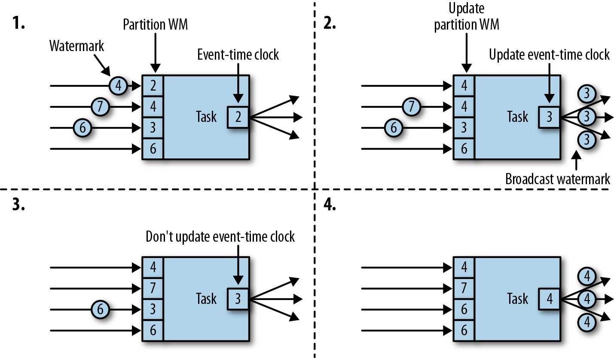
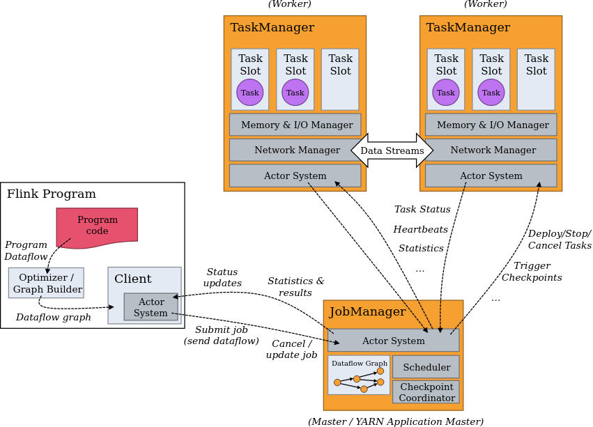

# Flink

## 1. Concepts

### 1.1. Flink programming interfaces

From higher-level to lower-level:
* SQL
* Table API (declarative)
* DataStream API
* Stateful Stream Processing

### 1.2. State

Stateful operations remember information across multiple events (for example to
perform aggregations).

Stateful pipelines are fault-tolerant through the use of checkpoints and
savepoints (manual checkpoints), which are mechanisms that regularly save state
to restore a pipeline after a failure.

A checkpoint contains a timestamp and the state of operators at this timestamp.
After failure, a pipeline can be resumed from a checkpoint by restoring the
state of operators and replaying the records from the checkpoint.

By default, state is stored in memory, but RocksDB can also be used.

#### 1.2.1. Keyed state

Keyed stated is maintained in a key-value store. State is partitioned and
distributed strictly together with streams that are read by stateful operators,
ensuring that all states updates are local and avoiding distributed
transactions.

#### 1.2.2. Checkpointing

Flink injects barriers into the data stream, at the stream sources, to separate
records that go in different snapshots. Barriers flow with records and do not
overtake records.

Operators push barriers downstream when they receive the barrier for all their
input streams and acknowledge the corresponding snapshot to the checkpoint
coordinator. After all sinks have acknowledged a snapshot, it is considered
completed and the job will never again ask the source for records before the
snapshot.

Operators that receive several input streams need to align these streams on the
snapshot barriers. When the operator receives a barrier in one stream it stops
processing records from that stream until it received the corresponding barrier
from all other streams. After that, the operator emits all pending records and
the barrier to downstream data streams, and state is written asynchronously to
the state backend. Unaligned checkpointing also exists, it reduces lag but also
leads to record duplication during recovery.

#### 1.2.3. Savepoints

Savepoints are manually-triggered checkpoints, and do not expire when newer
checkpoints are completed.

### 1.3. Event time, processing time, and watermarks

Processing time is the wall clock of the machine that is processing records.

Event time is the time at which events occurred in the source.

Flink measures progress of event time with watermarks, which flow as part of
the data stream and carry a timestamp. Watermark with timestamp t indicate that
event time has reached time t in that stream.

Watermarks allow operators to update their event-time clock. They receive
a distinct watermarks for every partition of their inputs. When a new watermark
arrives, the operator clock is advanced to the minimum of all partition
watermarks and the new value of the operator clock is broadcast to all
downstream partitions. Therefore, not every received watermark will advance the
operator clock.



Operators use watermarks to close aggregated windows: the window is closed when
the operator event-time clock passes the window's end boundary. The watermark
indicates that all records before the watermark have been received, and that
the window can be closed.

Watermarks are defined on specific record fields that are called **time
attributes**. In SQL DDL, watermarks are defined with a `WATERMARK` statement
on a field with type `TIMESTAMP(3)` or `TIMESTAMP_LTZ(3)` (millisecond
precision):

```sql
CREATE TABLE mytable (
    ...
    , event_timestamp TIMESTAMP(3)
    , WATERMARK FOR event_timestamp AS event_timestamp - INTERVAL '5' SECOND
)
...
```

If the field has the format year-month-day-hours-minutes-seconds-milliseconds,
we should use the type `TIMESTAMP`. If the field is formatted as an epoch
(milliseconds since 1970-1-1), the we should use `TIMESTAMP_LTZ`.

The optional `INTERVAL` statement defines the watermark strategy:
* Bounded out-of-order: e.g. `INTERVAL - '5' SECOND` emits a watermark on the
    maximum observed timestamp minus a delay of 5 seconds (allows records to be
    late by at most 5 seconds).
* Ascending timestamps: e.g. `INTERVAL - '0.001' SECOND` emits a watermark on
    the maximum observed timestamp minus 1 millisecond (allows successive
    records to have the same timestamps).
* Strictly ascending timestamp: no `INTERVAL` statement is specified, a
    watermark is emitted for the maximum observed timestamp.

### 1.4. Versioned tables

Versioned tables are dynamic tables (values can change over time) with a
primary key, the value for each key can be updated over time, and Flink
remembers the past value for each key.

For example, the Upsert-Kafka and Debezium Table API connectors generate
versioned tables, because each key is upserted (inserted if it does not
exist, otherwise updated). The 'standard' Kafka Table API connector only
generates dynamic tables, not versioned.

In the SQL API, versioned tables are defined with a `PRIMARY KEY` statement
(the `NOT ENFORCED` part is mandatory):

```sql
CREATE TABLE mytable (
    ...
    , id STRING
    , PRIMARY KEY (id) NOT ENFORCED
)
...
```

See the example
[temporal-join-event-time]("./examples/temporal-join-event-time") for an
example use of a versioned table (currency) with the Upser-Kafka connector.

## 2. Architecture



Two types of processes:
1. JobManager
2. TaskManager

The client (e.g.`flink run`) is not part of the program execution, it simply
builds an application graph and sends it to the job manager.

### 2.1. JobManager

Responsibilities:
* decides when to schedule the next tasks
* reacts to finished tasks (success or failure)
* coordinates checkpoints
* coordinates recovery on failures

Components:
* ResourceManager: manage task slots
* Dispatcher: provides interface to submit applications for execution, starts a
    JobMaster for each job, runs web interface
* JobMaster: manages execution of a single JobGraph. Each job has their own
    JobMaster

### 2.2. TaskManagers

Also called workers.

Each TaskManager is a JVM process.

Smaller unit of resource scheduling is a task slot. Number of task slots
indicates number of concurrent processing tasks.

Responsibilities:
* execute tasks of a job
* buffer and exchange data streams

### 2.3. Tasks and operator chains

Tasks are basic unit of work executed by Flink, and encapsulate exactly one
operator (or operator chain). Each task is executed by one thread.

An operator is a node in the job (logical) graph, and execute a defined
operation.

Subtasks are parallel subunits of a task which process a partition of a data
stream, and are executed by different workers.

Operator subtasks can be chained together into single tasks, which avoids
overhead of thread handover, increasing throughput and decreasing latency.

TaskManagers control how many tasks they accept with task slots. Memory is
divided evenly among task slots. A cluster needs as many task slots as the
highest parallelism used in the job.

### 2.4. Application execution

Flink jobs can be submitted to long-running Session Cluster, or an Application
Cluster.

An Application Cluster is dedicated to running one job. The cluster is
responsible for calling the `main()` method and build the JobGraph (not done by
the client).  A Session Cluster is a long-running cluster that accepts multiple job
submissions. Clients connect to it and submit a JobGraph.

Every Flink application has an execution environment. Streaming applications
use `org.apache.flink.streaming.api.environment.StreamExecutionEnvironment`.

The `DataStream` API calls made in the application build a job graph attached
to the execution environment. When the environment `execute()` method is
called, the job graph is packaged and sent to the JobManager, which
parallelizes the job and distributes it to TaskManagers for execution. Each
parallel slice of the job is executed in a task slot.

## 3. API

### 3.1. Table API

Basic job code:

```java
import org.apache.flink.table.api.EnvironmentSettings;
import org.apache.flink.table.api.Table;
import org.apache.flink.table.api.TableEnvironment;
import org.apache.flink.table.api.TableResult;


public class App {

    public static void main(String[] args) throws Exception {

        EnvironmentSettings settings = EnvironmentSettings
            .newInstance()
            .inStreamingMode()
            .build();

        TableEnvironment env = TableEnvironment.create(settings);

        env.executeSql("CREATE TABLE source ...");
        env.executeSql("CREATE TABLE sink ...");

        Table source = env.from("source");
        TableResult result = source.executeInsert("sink");
        result.print();
    }
}
```

Classes, interfaces details:
* `EnvironmentSettings`: Use the methods `newInstance()` and `build()` to
    access advanced settings.
* `TableEnvironment`: Responsible for connecting to external systems, managing
    the table catalog, executing SQL statements. The method `executeSql()`
    takes SQL query string and returns `TableResult`. Execute a `CREATE TABLE`
    statement to register a table in the catalog. Use the `from()` with a table
    name string to retrieve a registered `Table` object. The method
    `sqlQuery()` returns a `Table` object.
* `Table`: Fundamental abstraction of the table API. Does not contain
    information, but represents a pipeline of data transformations. Use the
    `execute()` method to execute the pipeline and retrieve data locally during
    development, or `executeInsert()` to write data to a sink table (shorthand
    for `insertInto()` followed by `execute()`.
* `TableResult`: Results of a statement execution. Use the `print()` method to
    visualize results on the console.

### 3.2. SQL API

#### 3.2.1. Windows with table-valued functions

Table-valued functions (TVF) are functions that return tables, so they can be
used in `FROM` clauses of SQL queries.

Flink has four built-in window TVFs: `TUMBLE`, `HOP`, `CUMULATE`, and
`SESSION`. These functions take as parameters a table, a time attribute column,
and various additional parameters depending on the function, then return all
original table fields plus three fields: `window_start`, `window_end`, and
`window_time` (time-attribute in in streaming mode and set to `window_end`
minus 1 millisecond).

Query examples are in
[window-table-valued-functions]("./examples/window-table-valued-functions").

#### 3.2.2. Joins

##### 3.2.2.1. Interval joins

These are joins restricted by a time constraints that bounds a time attribute
on both join sides.

The example [interval-joins]("./examples/interval-joins") shows how to
calculate late shipments (shipped more than four hours after the order):

```sql
SELECT *
FROM orders o, shipments s
WHERE o.order_id = s.order_id
    AND s.shipment_timestamp > o.order_timestamp + INTERVAL '4' HOURS;
```

##### 3.2.2.2. Temporal joins

###### 3.2.2.2.1. Event time temporal join

These join an arbitrary table (probe side) against a versioned table (build
side), allowing record enrichment with changing metadata at a certain point
in time. The versioned table retains the value of each record across time, so
it allows joins as of a certain point in time.

The example [temporal-join-event-time]("./examples/temporal-join-event-time")
shows how to calculate order price given changing currency conversion rates.

We define a versioned currency table with the Upsert-Kafka connector:

```sql
CREATE TABLE currency (
    k_currency STRING
    , conversion_rate DECIMAL(32,2)
    , update_time TIMESTAMP(3)
    , WATERMARK FOR update_time AS update_time - INTERVAL - '5' SECONDS
    , PRIMARY KEY (k_currency) NOT ENFORCED
) WITH (
    'connector' = 'upsert-kafka' -- this connector produces versioned tables, unlike the normal kafka connector
    , 'topic' = 'currency'
    , 'properties.bootstrap.servers' = 'localhost:9092'
    , 'key.format' = 'raw'
    , 'key.fields-prefix' = 'k_'
    , 'value.format' = 'json'
    , 'value.fields-include' = 'EXCEPT_KEY'
);
```

In general, and to maintain consistent message partitioning during processing,
the Kafka message key is the table key, so the option `key.format` is
mandatory. We specify a key prefix because there is also a field named
`currency` in the Kafka message value. Because we specify a key field prefix,
we must specify `value.fields-include = EXCEPT_KEY`.

Finally, we calculate the order price by taking into account the currency
conversion rate at the time of the order, using the `FOR SYSTEM_TIME AS OF`
syntax:

```sql
SELECT
     order_id
     , price
     , conversion_rate
     , price * conversion_rate as converted_price
     , orders.currency
     , order_timestamp
     , update_time
FROM orders
LEFT JOIN currency FOR SYSTEM_TIME AS OF orders.order_timestamp
ON orders.currency = currency.k_currency
;
```

Note that the join must involve the watermark of both table, and the primary
key of the versioned table.

###### 3.2.2.2.2. Processing time temporal join

Unclear how to make it work as described in the
[documentation](https://nightlies.apache.org/flink/flink-docs-release-2.0/docs/dev/table/sql/queries/joins/#processing-time-temporal-join).

When we try to pass a processing-time column to a temporal table function, we
have an error that indicates that we should pass a row-time (i.e. event-time)
column, so it looks like processing time temporal joins cannot be performed
with temporal functions (if at all).

###### 3.2.2.2.3. Temporal table function join

Temporal table functions allow to perform temporal joins on append-only
streams.

For example, we have an orders table and a currency table, and we want to
perform rate conversions on order amounts:

```sql
CREATE TABLE orders (
    amount DECIMAL(32, 2)
    , currency STRING
    , order_time TIMESTAMP(3)
    , WATERMARK FOR order_time AS order_time - INTERVAL '5' SECONDS
) WITH (
    'connector' = 'kafka'
    ...
);

CREATE TABLE currency (
    currency STRING
    , rate DECIMAL(32,2)
    , update_time TIMESTAMP(3)
    , WATERMARK FOR update_time AS update_time - INTERVAL - '5' SECONDS
) WITH (
    'connector' = 'kafka'
    ...
);
```

Defining a temporal table function is not possible in SQL, one has to use the
Table API:

```java
TemporalTableFunction rates = env
    .from("currency")
    .createTemporalTableFunction($("update_time"), $("currency"));

env.createTemporarySystemFunction("rates", rates);
```

Then a lateral join is used:

```sql
SELECT
    orders.currency
    , amount * rate AS converted_amount
    , amount
    , order_time
    , rate
    , update_time
FROM
  orders,
  LATERAL TABLE (rates(order_time)) r
WHERE r.currency = orders.currency
```

##### 3.2.2.3. Lookup join

A Lookup Join is used to enrich a table with data from a dimension table. The
join requires one table to have a processing time attribute and the other
table to be backed by a lookup source connector.

The example [lookup-join]("./examples/lookup-join")
shows how to enrich order data with customer information.

#### 3.2.3. Group aggregation

Group aggregation with built-in functions such as `DISTINCT`, `COUNT`, `SUM`,
etc. are supported with grouping sets (rollup, cube) are supported.

All rows in a group are aggregated into a single one.

See [group-aggregation]("./examples/group-aggregation") for examples.

Flink stores the state required to perform the aggregation over an unbouded
stream of records. State can grow very large, and you can control how much
state is stored with the configuration parameter `table.exec.state.ttl` (by
default 0, so state is kept forever).

#### 3.2.4. Over aggregation

Over aggregation have the format:

```sql
SELECT
    agg_func(agg_col) OVER (
        [PARTITION BY col1[, col2, ...]]
        ORDER BY time_col
        range_definition
    )
    , ...
FROM ...
```

An aggregated row is output for every row (contrary to group aggregation which
produces a single row per group).

Range intervals can be either time intervals:

```sql
RANGE BETWEEN INTERVAL '30' MINUTE PRECEDING AND CURRENT ROW
```

Or row intervals:

```sql
ROWS BETWEEN 10 PRECEDING AND CURRENT ROW
```

Only `CURRENT ROW` is supported for the upper boundary.

See [over-aggregation]("./examples/over-aggregation").

#### 3.2.5. Top N

By combining `ROW_NUMBER() OVER()` aggregation with a filter query (`WHERE` or
`QUALIFY`), one can perform top N queries.

See [topN]("./examples/topN").

#### 3.2.6. Deduplication

Deduplication is achieved with a `ROW_NUMBER() OVER()` query and a filter to
select the first row. This is similar to top N queries with a specific filter.

See [deduplication]("./examples/deduplication").

#### 3.2.7. Pattern recognition

Pattern recognition uses the [complex event
processing](https://nightlies.apache.org/flink/flink-docs-release-2.0/docs/libs/cep/)
library.

In SQL, this is implemented with a `MATCH_RECOGNIZE` query. Only a subset of
the full standard functionality is implemented, see [known
limitation](https://nightlies.apache.org/flink/flink-docs-release-2.0/docs/dev/table/sql/queries/match_recognize/#known-limitations)
for details.

See [pattern-recognition](./examples/pattern-recognition).

#### 3.2.8. User-defined functions

##### 3.2.8.1. Implement and use functions

To create a function, one must use the Table API and build a JAR that contains
the class that implements the custom function. See the following paragraphs for
examples, and read the code in
[examples/user-defined-functions](./examples/user-defined-functions).

It is recommended to use boxed primitives (e.g. `java.lang.Integer` instead of
`Int`) to support `NULL`.

To use the function in SQL, one must first load the JAR:

```sql
ADD JAR <jar-path>;
```

Then create the function from the JAR:

```sql
CREATE FUNCTION myfunction
AS '<package>.<function-class-name>'
LANGUAGE JAVA
USING JAR '<jar-path>.jar'
;
```

Then the function can be called:

```sql
SELECT myfunction(...);
```

In the Table API, the function is created and called like this:

```java
env.createTemporarySystemFunction("SubstringFunction", SubstringFunction.class);

Table mytable = env.fromValues(
    DataTypes.ROW(
        DataTypes.FIELD("id", DataTypes.BIGINT()),
        DataTypes.FIELD("name", DataTypes.STRING())
    ),
    ...
);

Table substring_name = mytable.select(
    $("id"),
    call("SubstringFunction", $("name"), 1, 3)
);
```

##### 3.2.8.2. Type inference

Flink’s user-defined functions implement an automatic type inference extraction
that derives data types from the function’s class and its evaluation methods
via reflection. If this implicit reflective extraction approach is not
successful, the extraction process can be supported by annotating affected
parameters, classes, or methods with `@DataTypeHint` and `@FunctionHint`.

The annotation `@DataTypeHint` replaces the default type inference logic of
function parameters and return types:

```java
import java.math.BigDecimal;
import java.time.Instant;

import org.apache.flink.table.annotation.DataTypeHint;
import org.apache.flink.table.functions.ScalarFunction;
import org.apache.flink.types.Row;


public class TestFunction extends ScalarFunction {

    @DataTypeHint("DECIMAL(12, 3)")
    public BigDecimal eval(Double a, Double b) {
        return BigDecimal.valueOf(a + b);
    }
```

The annotation `@FunctionHint` is defined at the class level, and is useful
if one evaluation method should handle multiple data types at the same time.

Users can even customize type inference further by overloading the method
`getTypeInference()` in the user-defined function class.

##### 3.2.8.3. Scalar functions

```java
import org.apache.flink.table.functions.ScalarFunction;


public class SubstringFunction extends ScalarFunction {
    public String eval(String s, Integer begin, Integer end) {
        return s.substring(begin, end);
    }
}
```

`eval` can be overloaded to support different argument types, and can also
accept variable arguments:

```java
public class SumFunction extends ScalarFunction {
    public String eval(String... values) {
        Integer result = 0;
        for (String val : values) {
            result += Integer.valueOf(val);
        }
        return result;
    }
}
```

##### 3.2.8.4. Table functions

```java
src/main/java/com/jonathanschnabel/SplitFunction.java
package com.jonathanschnabel;

import org.apache.flink.table.annotation.DataTypeHint;
import org.apache.flink.table.annotation.FunctionHint;
import org.apache.flink.table.api.*;
import org.apache.flink.table.functions.TableFunction;
import org.apache.flink.types.Row;
import static org.apache.flink.table.api.Expressions.*;


@FunctionHint(output = @DataTypeHint("ROW<word STRING, length INT>"))
public class SplitFunction extends TableFunction<Row> {

  public void eval(String str) {
    for (String s : str.split(" ")) {
      collect(Row.of(s, s.length()));
    }
  }
}
```

This function can be called like this:

```sql
SELECT * FROM TABLE(split_function('hello how are you?'));
```

## 4. Connectors

### 4.1. Kafka SQL connector

This connector does not automatically create topics, make sure relevant source
and sink topics exist before running an application.

If the option `scan.startup.mode = earliest-offset` is not used, the option
`properties.group.id` must be set because otherwise the source needs to know
which group to use to resume consuming offsets.

### 4.2. Upsert Kafka SQL connector

A primary key and time attribute must be defined on the table.

Compared to the Kafka connector, the following fields are not allowed:
* `key.fields`: the key is inferred from the table primary key.
* `scan.startup.mode`.

### 4.3. Print connector

This connector allows to print records to standard output (i.e. the TaskManager
`stdout`):

```sql
CREATE TABLE print_table (
    ...
) WITH (
    'connector' = 'print'
);
```

## 5. Gotchas

### 5.1. Idle sources and watermarks

Watermarks control when windows close, and need incoming source records to
advance. If a window should have closed but no event with time attributes past
the window end has arrived, operators do not know that the window has closed
and do not advance the watermark. Therefore, no record for the last window is
sent by the operator.

This can be solved by heartbeat records that are filtered
out during processing, therefore allowing operators to advance watermarks
without impacting computed records.

Another solution is to use the application-wide parameter
`table.exec.source.idle-timeout` or the table-specific parameter
`scan.watermark.idle-timeout` to ignore sources without new data, e.g. set it
to `5 min` or `5 sec`. However, if there no data on any source, the window will
stay open until some data comes on at least a source.

### 5.2. Column identifers in the Java table API

Make sure to do a static import of the `Expressions` class to be able to use
the `$` method (WTF) to generate column expressions from column names.

```java
import static org.apache.flink.table.api.Expressions.*;
```

### 5.3. Time attributes and temporal joins

If a temporal join does not generate records, double-check if the time
attributes are properly defined (i.e. the `WATERMARK` statement in SQL).

### 5.4. Connector data type mapping

With the JDBC connector reading a MariaDB/MySQL table, a `SERIAL` database
column should be read as `DECIMAL` in Flink SQL (`SERIAL` does not exist and
`BIGINT` leads to an error).

### 5.5. SQL ORDER BY clause

In streaming mode, the primary `ORDER BY` clause must be ascending on a
time-attribute field. Subsequent ordering is free.

## 6. The good, the bad, and the ugly

### 6.1. The good

Modern features, such as connectors to important data stores,
change-data-capture, machine-learning libraries.

### 6.2. The bad

Streaming concepts are complicated and not intuitive for engineers used to
batch data processing: watermarks, temporal tables, state retention, etc.

Flink Python API lacks critical functionality (e.g. full control of message
keys in the Kafka connector), and there seems to be nobody working on fixing
this.

SQL interface backed by Apache Calcite, lacks a lot of syntactic convenience:
e.g. numbered references do not refer to current query but target table
columns.

### 6.3. The ugly

Documentation is not super clear, complete code examples are rare and it takes
time to implement examples because of debugging.

The flink-training repository has been deprecated for 2 years but is still
referenced by the documentation. Flink has evolved fast so this repository does
not work as is on the latest version of Flink.

The flink-playgrounds repository looks up-to-date but is very heavy, the Kafka
example runs a full Kafka cluster in Docker (with Zookeeper, which is
deprecated in the latest Kafka version).

The API documentation for some important libraries (e.g. Kafka connector) is
poor, and it's difficult to write code using them.

There is no recent book written on Flink, and the software evolves very fast.
The book "Stream Processing with Apache Flink" (O'Reilly, 2019), was written
for Flink 1.7 (we are now at version 2.1).

There is a Flink ML library but it supports only Flink 1.17
([doc](https://nightlies.apache.org/flink/flink-ml-docs-release-2.3/docs/try-flink-ml/java/quick-start/)).

## 7. Run examples locally

### 7.1. Run Flink
Follow the
[documentation](https://nightlies.apache.org/flink/flink-docs-release-1.20/docs/try-flink/local_installation/#downloading-flink)
to download the [Flink
binary](https://www.apache.org/dyn/closer.lua/flink/flink-2.0.0/flink-2.0.0-bin-scala_2.12.tgz) and extract it:

```bash
tar -xzf flink-*.tgz
```

Then go into the extracted folder and start Flink:

```bash
./bin/start-cluster.sh
```

Start the Flink SQL CLI:

```bash
./bin/sql-client.sh
```

To install Flink ML, download the [source
JAR](https://dlcdn.apache.org/flink/flink-ml-2.2.0/apache-flink-ml-2.2.0.tar.gz)
then extract it and copy the contents of the `deps/lib` directory in the `lib`
directory of the Flink installation:

```bash
cp apache-flink-ml-2.2.0/deps/lib/* <flink-lib-directory>
```

### 7.2. Run Kafka

Run a Kafka broker in a container:

```bash
docker run --detach --name kafka-broker apache/kafka:3.9.1
```

The bootstrap server will be available from `http://localhost:9092`. If needed,
the Kafka CLI tools are available in `/opt/kafka/bin` inside the container.

Setup the Python client environment by executing the script
`examples/setup_client`.

In each example folder, produce the Kafka records necessary for Flink queries
by executing the script `produce`.

Examples are tested with Python 3.9.

We use the library `confluent-kafka` version `2.2.0` for Python
Kafka clients.
