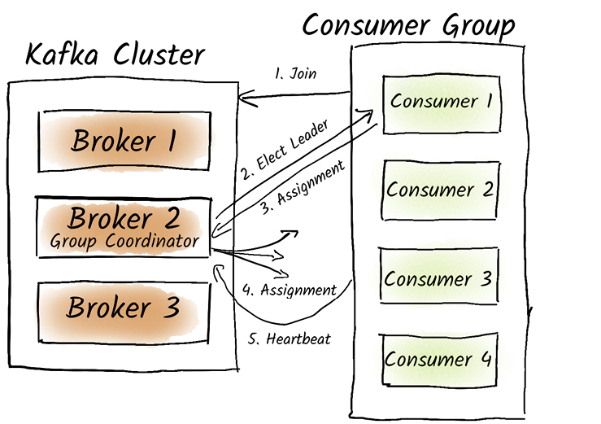

# Kafka

## What is Kafka

### Purpose

Kafka is mainly used to exchange data between systems, it does not replace
databases, key-value stores, or search engines.

### Log

Kafka is a distributed log, in which data is stored in topics, sharded into
partitions that allow topics to scale horizontally and parallel processing.

A log is an ordered list of timestamped and immutable elements where elements
are added at the end, and read from a specific position (offsets).

## Design

### Components of Kafka

A Kafka cluster is made of 3 components:
 * coordination cluster
     * checks brokers are still reachable and functional, add new brokers and
         remove existing brokers when necessary
    * was previously done by Zookeeper
    * coordination role can be fulfilled by brokers
    * there should be 3 or 5 nodes (for increased reliability)
 * brokers
     * receive, store, and make messages available for retrieval
     * one broker acts as a controller, which is responsible for managing state
         of partitions and replicas (e.g. assign brokers to partitions and
         designate a partition leader)
 * clients
    * any producer or consumer

Producers write to topics, and can control to which partitions messages are
written to via keys (messages with the same key end up in the same partition).

Consumer groups are used to scale consumers and share the workload. One
partition is consumed by one and only one consumer within a group.

### Replication

Data from topics is replicated: it is copied to other brokers. Replication is
configurable at the topic level, each topic can have a different replication
factor.

Kafka replication follow the "one leader-several followers" strategy. Each
partition has its own leader and followers. If we have a topic replication
factor of 3, each partition will have one leader and two followers.

Producers and consumers interact with the leader broker. Followers replicate
data by requesting topic messages from the leader. Followers inform the leader
of their current offset, so the leader knows when a follower has consumed a
message.

When the partition leader fails, another leader is elected among in-sync
replicas or eligible leader replicas.

Use the tool `kafka-topics.sh` with the parameters
`--under-replicated-partitions` or `--under-min-isr-partitions` to debug
replication issues.

Kafka topics have a 'preferred leader', which is shown at the top of the
replica list.

The tool `kafka-leader-election.sh` can be used to rebalance leaders manually.
The argument `--election-type` (required) controls how the leader is elected:
`preferred` used the preferred leader, and `unclean` allows to select a leader
among non-in-sync replicas (only to use in extreme circumstances because this
can lead to data loss!).

#### In-sync replicas

Followers fetch data from the leader at regular intervals. A follower is in
sync if it has retrieved all messages from the leader within the past 30
seconds (can be changed with broker configuration `replica.lag.time.max.ms`. By
default, a replica asks for new messages every 500 ms (can be changed with
broker configuration `replica.fetch.wait.max.ms`).

If a replica has not manage to consume all messages up to the Log End Offset
(LEO) of the leader at least once in the maximum lag time, it is removed from
the list of in-sync replicas by the leader.

A replica can also be removed from in-sync replicas if it stops responding to
heartbeats.

#### High watermark (HWM)

The HWM is the log position up to which all ISR have consumed messages, in
other words the smallest LEO committed to the leader among all ISRs.

The HWM also ensures that consumers with read-committed isolation do not see
messages past the HWM (i.e. not consumed by all replicas).

The HWM does not advance if there are less than `min.insync.replicas` in sync.

### Producers

#### Message acknowledgements

Producers use acknowledgements (ACKs) to confirm a message has been
successfully sent to a broker.

There are three producer configuration options:
* `acks=all`: partition leader sends ACK to producer after all in-sync replicas have
    replicated the message. Highest reliability. Data loss may occur if all
    replicas are on the same rack and the rack power source fails (Kafka does
    not immediately flush messages to disk, but relies on OS page cache for
    high performance). This is the default setting.
* `acks=1`: broker sends ACK to producer as soon as it receives it. Data loss
    may occur if the leader fails immediately after ACK.
* `acks=0`: no ACK is sent. Highest performance but lowest reliability.

For `acks=all`, `min.insync.replicas` must replicate the message before an ACK
is sent. If not enough replicas are reachable or in sync, the producer receives
the error `NOT_ENOUGH_REPLICAS` and retries to sent the message.

#### Delivery guarantees

At-most-once delivery is achieved with `acks=0`. Messages may be lost.

At-least-once delivery is achieved by setting `min.insync.replicas` to a
reasonable value (e.g. 2) and `acks=all`. Duplication may occur.

Exactly-once delivery is achieved with `acks=all` and
`enable.idempotence=true` (`max.in.flight.requests.per.connection` must be at
most 5 because broker only retains at most 5 batches for each producer, and
`retries` must be greater than 0). Idempotence is implemented with the producer
sending a sequence ID along with each message, so that the broker can ignore
duplicate sequence IDs, and ensure that messages are received in the correct
order). If duplicate messages arrive to the broker, only ACK is resent and
message is not persisted. If messages arrive out of order, NACK (negative ACK)
is sent, and the producer should retry.

#### Transactions

See [documentation](https://kafka.apache.org/documentation/#usingtransactions).

Transactions allow atomic writes across multiple partitions, for example to
consume a message from one topic, then write it to another topic atomically.

The producer must set the property `transactional.id`, and ensure that
different producers use different transactional IDs.

When a consumer is involved in the transaction, the important part is to use
the consumer configuration `enable.auto.commit=false` to avoid advancing
committed offsets outside of the transaction. Then, after the consumed message
has been processed and produced to another topic, we call the producer method
`send_offsets_to_transaction()` to commit offsets as part of the transaction.

The consumer `isolation.level` must be set to `read_committed`.
This is because Kafka transactions work similarly to two-phase
commits, where messages are first produced and then confirmed using commit
markers, or rollbacked using abort markers. If `isolation.level` is set to
`read_uncommited`, consumers would see rollbacked messages.

See this [Python
snippet](https://github.com/confluentinc/confluent-kafka-python/blob/master/examples/eos_transactions.py)
to see how transactions can be implemented in the producer and consumer.

This is how Kafka Streams work.

## Cluster management

### KRaft

Since Kafka 3.5, Zookeeper is deprecated for coordinating Kafka (support for
Zookeeper dropped in Kafka 4.0) and [Kafka
Raft](https://kafka.apache.org/documentation/#kraft) (KRaft) is used for
cluster coordination.

Zookeeper adds more complexity with a separate control cluster, and is too
slow when scaling massively the number of partitions.

Kafka brokers have two possible roles: controller, broker (can be both).
Number of controller should be odd (3 minimum, 5 should be enough for most
use-cases).

Coordination is achieved via topic `__cluster_metadata` (replicated on all
brokers) which contains everything that was previously in Zookeeper.

### Client connections

A client needs to connect to the leader of a partition. Leaders are distributed
across the cluster. Clients make a metadata request to obtain partition leader
identity, any broker can answer this request.

Client specify a bootstrap server from which it can obtain metadata. It's best
to specify the list of all brokers, or better, a load balancer in front of all
brokers.

A client does not need to constantly keep metadata up-to-date. If a problem
occurs (e.g. leader failure) they can fetch metadata again.

### Broker failure

When a partition leader fails, one of the replicas is elected as the new
leader. During leader election, clients can experience a short delay in
fetching messages.

## Tune for performance

Throughput is not the only important metric (otherwise a semi-truck loaded with
SD cards would beat any system), latency is key.

### Topic configuration

Topics horizontally scale with partitions, this allows to distribute load
across brokers and consumers. Bear in mind that message ordering is guaranteed
only within a partition and if `enable.idempotence=true` is set on the
producer.

How many partitions? If the consumer is the bottleneck (most common case),
determine how many consumers are needed (e.g. single consumer needs 100ms to
consume a message, and we need to process 100 message/second at peak, we need
10 consumers and therefore 10 partitions). 12 partitions is plenty for most
scenarios.

Note: if systems downstream of consumers are the bottleneck, increasing
partitions will likely have no effect.

Too many partitions risks:
* puts CPU, memory, and file handling pressure on broker nodes, and is more
  difficult to monitor
* increased costs (e.g. Confluent)

Recommended to have at most 4,000 partitions per broker, and at most 200,000
partitions per cluster (soft limit, KRaft is more performance than Zookeeper).

Kafka has a concept of [share
groups](https://cwiki.apache.org/confluence/display/KAFKA/KIP-932%3A+Queues+for+Kafka)
that allow queue-like behavior and parallelize consumption beyond the number of
partitions (at the cost of no ordering guarantees).

Increasing the number of partitions on the same topic has risks:
* temporary imbalance in partitions (initially empty)
* transient ordering issues (as messages with the same key can end up in a
    different partition due to the modulo operator) until old data is deleted
    after the retention period

These can be mitigated by creating a new topic (can be a topic with the same
name if we tolerate downtime), but translating consumer offsets from the old to
the new topic is difficult (not a problem if message processing is
idempotent).

### Producer configuration

Throughput can be improved through batching. The producer groups messages by
topic and partition before sending them to a broker. Larger batches mean fewer
network requests.

Parameters:
* `batch.size`: Maximum size of a batch in bytes (default 16,384). Default is
    usually too low. This can be set to the message size (1 MB by default).
* `linger.ms`: How long the producer waits for additional messages before
    sending a batch (default is 0, so the producer sends messages as quickly as
    possible). Event with 0, batching occurse because messages cannot always be
    sent as quickly as they are produced. Default is usually too low, 10 ms is
    good for high message rates (at least 100 message/second).

Setting `acks=1` (or even 0) can improve performance but this is more a
reliability setting.

The setting `compression.type`, which can be set to none (default), gzip,
snappy, lz4, or zstd, can improve performance and reduce resource requirements.
Kafka compresses whole batches, which the partition leader stored as-is on
disk, and sends it as-is to followers and consumers. Some producers can write
compressed messages and other not for the same topic (but better to avoid).

Kafka provides a tool to test producer performance:
`kafka-producer-perf-test.sh`. [JMeter](https://jmeter.apache.org/) is better
for end-to-end performance tests.

### Broker configuration

Check [Cloudera recommendations](https://docs.cloudera.com/documentation/enterprise/latest/topics/kafka_system_level_broker_tuning.html).

Brokers do not commit written data to the filesystem, but only writes data to
the page cache in memory and relies on the OS to flush data to disk when it
makes sense. This means that a power failure can lead to loss of ACK-ed data,
so topics should be replicated and replicas put on different power sources.

Kafka can leverage zero-copy transfer by the Linux kernel to speed up data
writes, but only if TLS is not used.

OS settings to potentially adjust:
* maximum number of open file descriptors
* minimize or even disable memory page swapping

Kafka broker parameters:
* `num.network.threads`: If TLS is used, set to 6 (default is 3).
* `num.io.threads`: If multiple disks are used, this should match the number of
    disks.
* `queued.max.requests`: If high number of producers and consumers is used,
    increased beyond the default of 500 to align with the number of clients.

Number of brokers:
* estimate based on infrastructure requirements (memory, disk, network
    throughput needed)

### Consumer configuration

Use a consumer group to parallelize message consumption, as consumer processing
is usually the bottleneck.

Parameters:
* `fetch.min.bytes`: Broker waits for at least this number of bytes before
    responding to the consumer (default is 1). Remember broker usually sends
    batches, it's possible to receive several batches in one response.
* `fetch.max.wait.ms`: Broker waits for at most this time before sending a
    response (even if there's less than `fetch.min.bytes` of data). Default is
    500 ms.

Never set these parameters to 0, as this could overload the system.

Consumer performance tests can be performed with the script
`kafka-consumer-perf-test.sh`. A configuration file needs to be passed as an
argument to `--consumer.config`.

## Inner workings

### Producer

After the `produce()` method is called, the following happens in the
`librdkafka` library:
1. Data is serialized to a byte array (Kafka only deals with byte arrays) with
   a serializer (JSON, protobuf, Avro, custom, etc.).
2. Data is partitioned to decide which partition to write to. We could also
   give a partition to `produce()`, but this is not recommended.
3. Data is stored in a partition-specific buffer.
4. Once `batch.size` data is in the buffer or `linger.ms` has elapsed, a batch
   is sent to the partition leader. Depending on ACK settings, the producer
   may wait for an ACK.
5. If we receive an ACK in time, the success callback is called.
6. If we do not receive an ACK, we retry until maximum retries are reached.
7. If an error occurs, an error is thrown.

If the producer waits for an ACK, it does so until `request.timeout.ms` has
elapsed. If no ACK is received, the producer waits for `retry.backoff.ms` and
then retries to produce the batch. If the producer continues to fail and
`delivery.timeout.ms` has elapsed before the producer received an ACK, it
throws an error.

If the message buffer becomes full, the producer waits for `max.block.ms` for
space to become available before throwing an error.

### Consumer

#### Offset management

Process is similar to what happens when broker processes producer requests
except I/O threads read data instead of writing it. The purgatory is used to
keep messages until `fetch.min.bytes` or `fetch.max.wait.ms` are satisfied.

In Kafka, the consumer is responsible for tracking which messages it has read
and request specific offsets from brokers.

Kafka provides built-in support for stateless client (do not store their
offsets explicitly) by storing client offsets in the topic
`__consumer_offsets` (compacted). When using transactions to store offsets in
this topic, this provides exactly-once guarantees. Offsets are stored per
consumer group.

The script `kafka-consumer-groups.sh` fetches consumer group information, such
as lag, Log End Offset (LEO), etc. LEO is the offset of the next message that
will be written to this partition.

Important: using the wrong consumer group ID can result in one consumer
overwriting the offsets of another, leading to potential data loss or
processing inconsistencies.

#### Kafka Rebalance Protocol

Consumer group coordination via rebalance protocol:
* One broker, the **group coordinator**, is responsible for a specific group.
* Consumers send a 'find coordinator' request to any broker, and the broker
   responds with the identity of the group coordinator.
* Consumers sent a 'join' request to the group coordinator. This is a
   synchronization point and all group members must report to the coordinator.
   If there already are members in the group, they are removed to re-join with
   a new 'join' request.
* The first group member to join is designated **group leader**, which is
    responsible for deciding which member handles which partition and sends the
    partition distribution plan to the coordinator, who passes these
    assignments back to the other group members. After that, members can start
    consuming messages.
* The group coordinator ensures members are active by monitoring heartbeats,
    and removes inactive members. Heartbeat intervals are controlled by
    `heartbeat.interval.ms` and timeout for active members is controlled by
    `session.timeout.ms`.

The distribution of partitions to consumers is controlled by the setting
`partition.assignment.strategy`:
* `RangeAssignor`: Assuming all topic have the same number of partitions, each
    consumers is assigned the same partition ID for each topic (partition 0 of
    all topic going to the same consumer, and so on). Useful for topic joins
    (although Kafka Streams should be used instead) but some consumers may not
    participate (e.g. 3 consumers but 2 topics with 2 partitions each).
* `RoundRobinAssignor`: Evently distributes partitions across consumers of the
    group, but rebalance is disruptive and all consumers are re-assigned
    partitions.
* `StickyAssignor`: Tries to preserve as many existing partition assignments as
    possible, but all consumers stop during rebalance.
* `CooperativeStickyAssignor`: Avoids stopping all consumers during rebalance
    by performing two rebalances in succession. During the first rebalance,
    consumers let go partitions that should be moved to a new consumer. During
    the second rebalance, dangling partitions are re-assigned. Most consumers
    keep consuming during the rebalance.

#### Static memberships

If infrastructure is automated, a failed consumer is automatically restarted
(e.g. in Kubernetes StatsfulSets). Instead of triggering a rebalance every time
a consumer restarts, we increase `session.timeout.ms` to several minutes and
set `group.instance.id` to a unique value per consumer, ensuring the consumer
gets the same ID after a restart. A rebalance only needs to be performed when
consumers are added, a consumer does not report for a long time, or the number
of partitions changes.

### Broker

#### Processing of producer requests

When a partition leader receives a produce request, the following happens:
1. Network threads receive and process the producer request (including auth).
2. Message batches are put on a request queue.
3. I/O threads pull message batches from the queue and append them to the end
   of the current log segment for the corresponding partition. Kafka does not
   ensure persistance to disk (only write to the OS filesystem page cache).
4. Responses are stored on the purgatory until follower brokers confirm
   message replication.
5. Responses are put on the response queue where they are pulled by network
   threads which send an ACK to the producer.

We can configure message persistance with the following configuration:
* `flush.ms`: Specifies after how many milliseconds Kafka triggers `fsync` to
    flush messages to disk.
* `flush.messages`: Specifies after how many messages an `fsync` is triggered.

By default these settings are set to the `long` datatype, so `fsync` is never
triggered in practice. It is not recommended to alter these settings because
performance penalty is high. Reliability should be achieved via replication
instead, and replica placement on different racks.

#### Data storage

In Strimzi deployments, broker pods store their data in `/var/lib/kafka/`.

We can find the following files and directories:
* file `bootstrap.checkpoint`: used by KRaft.
* folder `__cluster_metadata-0`: contains data for partition 0 of the
    `__cluster_metadata` topic, used by KRaft.
* file `meta.properties`: contains broker ID, cluster ID, directory ID, and
    metadata version.
* file `cleaner-offset-checkpoint`:
* file `log-start-offset-checkpoint`:
* file `recovery-point-offset-checkpoint`:
* file `replication-offset-checkpoint`:
* various folders that start with a topic name and end with a number: contains
    data files for the Nth partition of the topic.

The `xxx-checkpoint` files start with two number on two lines: the first is the
metadata version, and the second the number of lines of actual information
follow.

##### File `replication-offset-checkpoint`

First line: metadata version.
Second line: number of data lines that follow.

Each data line starts with a topic name, followed by the partition number,
followed by the log offset up to which messages for this partition have been
successfully replicated to all replicas.

##### File `recovery-offset-checkpoint`

Same structure as `replication-offset-checkpoint` but offsets refer to the log
position up to which messages have been successfully persisted to the hard
drive by the OS.

##### File `log-start-offset-checkpoint`

Contains information on the offset of the first message in partitions (not
necessarily 0 because of compaction).

##### File `cleaner-offset-checkpoint`

Offsets up to which the Kafka log cleaner has compacted messages.

##### Partitions directory

When a topic is created, metadata for this topic is created in checkpoint files
and a sub-folder is also created for each partition, following the format
`topicname-partition#`.

Each partition sub-folder has the following files:
* `xxx.index`: Contains the byte position associated with the respective
    offsets in the log, to find messages faster. This is done for every 4K
    bytes added to the log. Can be configured with `index.interval.bytes`.
* `xxx.log`: Contains messages. Can inspect file with `kafka-dump-log.sh
    --files xxx.log`. For each batch we can see the offset of the first
    `baseOffset` and last `lastOffset` of the batch. The checksum of the batch
    is `crc`, and `position` indicates the byte position in the segment where
    the batch begins.
* `xxx.timeindex`: Similar to index files, but match a timestamp and and
    offset.
* `leader-epoch-checkpoint`: Usual checkpoint file structure. Each data line
    contains the number of previous partition leaders, and then the current log
    offset at the time of the leader selection. The leader epoch is incremented
    with each leader change and is used to ensure that two brokers don't
    accidentally claim the leader role at the same time. When a leader sends a
    message for replication, it sends its current leader epoch. If a follower
    detects an outdated leader epoch it ignores it.
* `partition.metadata`: Contains metadata version and topic ID.

The file names for index and log files are the first offset found in the file.

##### Segments

Partitions are divided into segments, each consisting of log and index files.

Kafka creates a new segment when the segment exceeds a certain size (1GB by
default) or has reached a certain age (7 days by default).

##### Deletion

When we delete a topic, files are not immediately deleted, they are marked for
deletion by adding an extension similar to `.<uniqueID>-delete`. Files and
directory are permanently deleted after 1 min.

## Data schema

Confluent Schema Registry is part of Confluent Enterprise.

[Karapace](https://github.com/Aiven-Open/karapace) is an open-source
alternative, and also serves as a Kafka REST proxy.

## Gotchas

### Message partitioning

The library `librdkafka` (used by the Python client library) uses a different
hash algorithm than the Java client library. If both languages are used to
produce to the same topics, messages may be partitioned inconsistently. To
ensure correctness, one should set the partitioner to `murmur2_random` in
`librdkafka` producers. 

### Consumer parallelism

Consumers a part of a group in which topic partitions are distributed across
members of the group, each partition being consumed by one and only one member.
Therefore, the maximum number of consumers in a group should be the number of
partitions, otherwise there will be idle consumers with no partition.

Reducing the number of partitions is not possible as this would result in data
loss. Reducing the number of partitions would mean that some messages would
move to new partitions, and this would break message ordering guarantees.

## Important configuration properties

[Reference](https://kafka.apache.org/documentation/)

### Topic

* `min.insync.replicas`: Minimum number of replicas that must acknowledge a
    write for the write to be considered successful (i.e. for leader to send
    ACK back to prodcer). Messages are visible to consumers after they are
    replicated to all in-sync replicas and `min.insync.replicas` is met. A
    typical configuration is a replication factor of 3 and
    `min.insync.replicas` equal to 2.
* `index.interval.bytes`: How many bytes of messages are added to the topic
    before an a new index entry is created.
* `segment.ms`: Time interval after which a new segment is created.
* `segment.bytes`: Maximum segment size.
* `file.delete.delay.ms`: Delay before permanent data deletion.

### Producer

* `acks`: Number of acknowledgements the leader requires before it considers a
    request complete. Can be `all`, `1`, or `0`. `all` is required for
    idempotence. Default is `all`.
* `enable.idempotence`: To ensure that the producer will send exactly one copy
    of each message to a topic. Default is `true`.
* `max.in.flight.requests.per.connection`: Maximum number of unacknowledged
    requests the client will send on a single connection before blocking.
* `transactional.id`: Ensure that transactions using the same ID have been
    completed before starting new transactions. Default is null (transactions
    are disabled).
* `compression.type`: Message compression (default is none). lz4, zstd, and
    snappy can be more performant than gzip.
* `batch.size`: Batch size in bytes (default is 16,384). Try values up to 1MB.
* `linger.ms`: Time waited to fill a batch. Higher values lead to higher
    latency but higher throughput. Try between 10ms and 100ms (default is 0).
* `compression.type`: Compression for all data sent by the producer, default is
    no compression. Full batches are compressed, so more batching means better
    compression.
* `request.timeout.ms`:
* `retry.backoff.ms`:
* `delivery.timeout.ms`:
* `max.block.ms`:

### Consumer

* `enable.auto.commit`: Allow the consumer to periodically commit offsets in
    the brackground (default is true). Must be set to false when a consumer
    takes part in producer transactions.
* `isolation.level`: If set to `read_committed`, `consumer.poll()` only returns
    committed transactional messages. With `read_uncommitted` (default), all
    messages are  returned.
* `fetch.min.bytes`: Minimum amount of data the server should return for a
    fetch request. Default is 1. Increasing can improve throughput but increase
    latency.
* `fetch.max.wait.ms`: The maximum amount of time the server will block before
    answering the fetch request if `fetch.min.bytes` is not satisfied. Default
    is 500 ms.
* `auto.offset.reset`: What to do when there is no initial offset in Kafka or
    if the current offset does not exist any more (e.g. data was deleted).
    Default is 'latest', i.e. read from the end of a partition. 'earliest'
    means the client reads from the beginning of the partition.
* `client.rack`: Allows clients to read from the nearest replicas, instead of
    the partition leader.
* `heartbeat.interval.ms`: Heartbeat interval in milliseconds.
* `session.timeout.ms`: Timeout after which consumers are considered inactive
    if they failed to send heartbeats.
* `partition.assignment.strategy`: How partitions are distributed across
    consumers.
* `group.instance.id`: Should be set to a unique identifier for the consumer
*   that allows to treat it as a static member.

### Broker
* `num.network.threads`: If TLS is used, set to 6 (default is 3).
* `num.io.threads`: If multiple disks are used, this should match the number of
    disks.
* `queued.max.requests`: If high number of producers and consumers is used,
* `log.index.interval.bytes`: How many bytes of messages are added to a topic
    before a new index entry is created.
* `log.segment.bytes`: Maximum size of a segment before creating a new one.
* `log.roll.ms`: Maximum age of a segment before creating a new one.
* `log.segment.delete.delay.ms`: Delay before permanent data deletion.
* `replica.lag.time.max.ms`: Maximum delay to consider a replica in-sync.
* `replica.fetch.wait.max.ms`: Time interval after which a follower fetches
    messages again from the leader.
